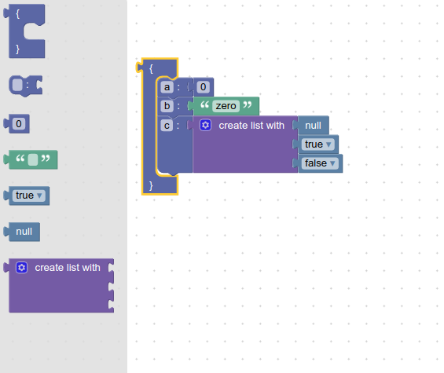
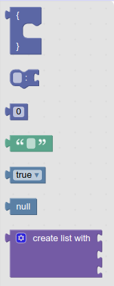
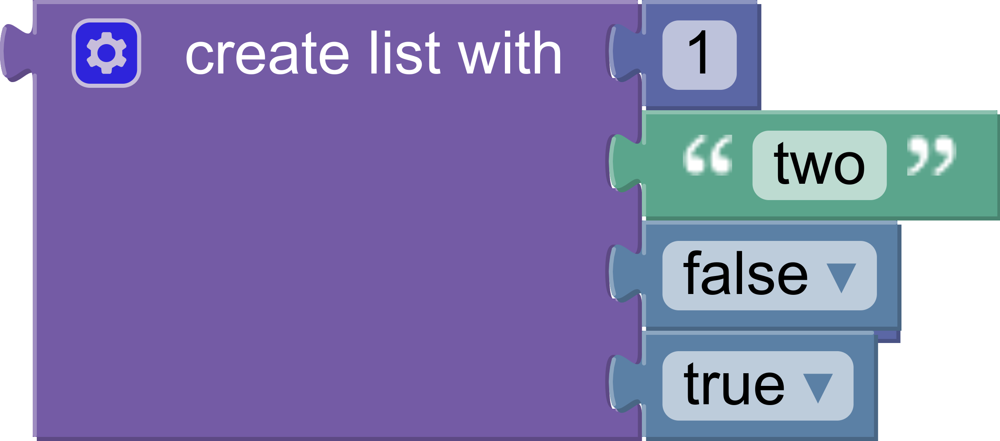
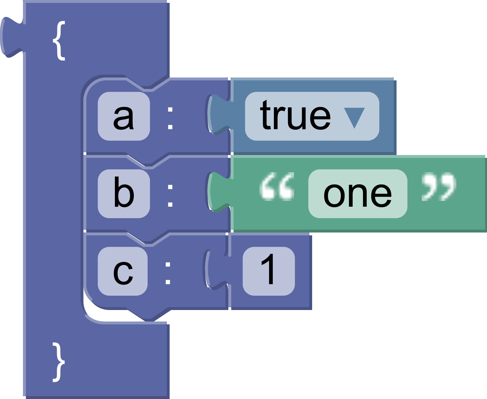

author: Rachel Fenichel
summary: Codelab showing how to create and use a custom generator.
id: custom-generator
categories: blockly,codelab,generator
status: Published
Feedback Link: https://github.com/google/blockly-samples/issues/new/choose

# Build a custom generator

## Codelab overview

### What you'll learn

- How to create a custom language generator.
- How to create block generator definitions for existing blocks.
- How to create block generator definitions for new blocks.
- How to use a custom generator in an application.

### What you'll build

You will build a JSON generator that implements the [JSON language spec](https://www.json.org/json-en.html).



### What you'll need

- Familiarity with JSON and the JSON specification.
- Basic understanding of blocks and toolboxes in Blockly.
- NPM installed ([instructions](https://docs.npmjs.com/downloading-and-installing-node-js-and-npm)).
- Comfort using the command line/terminal.

## Setup

This codelab will demonstrate how to add code to the Blockly sample app to create and use a new generator.

### The application

Use the (`npx @blockly/create-package app`)[https://www.npmjs.com/package/@blockly/create-package) command to create a standalone application that contains a sample setup of Blockly, including custom blocks and a display of the generated code and output.
  1. Run `npx @blockly/create-package app custom-generator-codelab`.  This will create a blockly application in the folder `custom-generator-codelab`.
  1. `cd` into the new directory: `cd custom-generator-codelab`.
  1. Run `npm start` to start the server and run the sample application.
  1. The sample app will automatically run in the browser window that opens.

The initial application has one custom block and includes JavaScript generator definitions for that block. Since this codelab will be creating a JSON generator instead, it will remove that custom block and add its own.

The complete code used in this codelab can be viewed in blockly-samples under [`examples/custom-generator-codelab`](https://github.com/google/blockly-samples/tree/master/examples/custom-generator-codelab).

Before setting up the rest of the application, change the storage key used for this codelab application. This will ensure that the workspace is saved in its own storage, separate from the regular sample app, so that it doesn't interfere with other demos. In `serialization.js`, change the value of `storageKey` to some unique string. `jsonGeneratorWorkspace` will work:

```js
// Use a unique storage key for this codelab
const storageKey = 'jsonGeneratorWorkspace';
```

### Blocks

This codelab will use two custom blocks, as well as five blocks from Blockly's standard set.

The custom blocks represent the *Object* and *Member* sections of the JSON specification.

The blocks are:
- `object`
- `member`
- `math_number`
- `text`
- `logic_boolean`
- `logic_null`
- `lists_create_with`

### Custom block definitions

Create a new file in the `src/blocks/` directory called `json.js`. This will hold the custom JSON-related blocks. Add the following code:

```js
import * as Blockly from 'blockly';

export const blocks = Blockly.common.createBlockDefinitionsFromJsonArray([{
  "type": "object",
  "message0": "{ %1 %2 }",
  "args0": [
    {
      "type": "input_dummy"
    },
    {
      "type": "input_statement",
      "name": "MEMBERS"
    }
  ],
  "output": null,
  "colour": 230,
},
{
  "type": "member",
  "message0": "%1 %2 %3",
  "args0": [
    {
      "type": "field_input",
      "name": "MEMBER_NAME",
      "text": ""
    },
    {
      "type": "field_label",
      "name": "COLON",
      "text": ":"
    },
    {
      "type": "input_value",
      "name": "MEMBER_VALUE"
    }
  ],
  "previousStatement": null,
  "nextStatement": null,
  "colour": 230,
}]);
```

This code creates the block definitions, but it doesn't register the definitions with Blockly to make the blocks usable. We'll do that in `src/index.js`.
Currently, the app imports `blocks` from the original sample file, `text.js`. Instead, it should import the definitions that were just added. Remove the original import:

```js
// Remove this!
import {blocks} from './blocks/text';
```

and add the import for the new blocks:

```js
import {blocks} from './blocks/json';
```

Later in the file the block definitions are registered with Blockly (this code is already present and does not need to be added):

```js
Blockly.common.defineBlocks(blocks);
```

### Toolbox definition

Next, define a toolbox that includes these custom blocks. For this example, there's a flyout-only toolbox with seven blocks in it.

The file `src/toolbox.js` contains the original sample toolbox. Replace the entire contents of that file with this code:

```js
export const toolbox = {
  'kind': 'flyoutToolbox',
  'contents': [
    {
      'kind': 'block',
      'type': 'object'
    },
    {
      'kind': 'block',
      'type': 'member'
    },
    {
      'kind': 'block',
      'type': 'math_number'
    },
    {
      'kind': 'block',
      'type': 'text'
    },
    {
      'kind': 'block',
      'type': 'logic_boolean'
    },
    {
      'kind': 'block',
      'type': 'logic_null'
    },
    {
      'kind': 'block',
      'type': 'lists_create_with'
    },
  ]
}
```

Our `index.js` file already handles importing the toolbox and using it in Blockly.

If the server is already running, refresh the page to see changes. Otherwise, run `npm start` to start the server. New blocks should now exist in the toolbox, like this:



The app is still trying to generate and run JavaScript for the workspace, instead of JSON. We will change that soon.

## The basics

A *language generator* defines the basic properties of a language, such as how indentation works. *Block generators* define how individual blocks are turned into code, and must be defined for every block used.

A language generator has a single entry point: `workspaceToCode`. This function takes in a workspace and:
- Initializes the generator and any necessary state by calling `init`.
- Walks the list of top blocks on the workspace and calls `blockToCode` on each top block.
- Cleans up any leftover state by calling `finish`.
- Returns the generated code.

### Create the language generator

The first step is to define and call the custom language generator.

A custom language generator is simply an instance of `Blockly.Generator`. Create a new file `src/generators/json.js`. In it, import Blockly and call the `Blockly.Generator` constructor, passing in the generator's name and storing the result.

```js
import * as Blockly from 'blockly';

export const jsonGenerator = new Blockly.Generator('JSON');
```

### Generate code

Next, hook up the new generator with the sample app. First, remove the old code that imports the new block generator properties and assigns them to the `javascriptGenerator`. Remove these lines from `src/index.js`:

```js
// Remove these lines!
import {generator} from './generators/javascript';
import {javascriptGenerator} from 'blockly/javascript';

// Also remove this line! (further down)
Object.assign(javascriptGenerator, generator);
```

Now import the new generator:

```js
import {jsonGenerator} from './generators/json';
```

Currently, there are two panels in the app next to the workspace. One shows the generated JavaScript code, and one executes it. The one panel showing the generated Javascript code will be changed to show the generated JSON code instead. Since JSON can't be directly executed, the panel that shows the execution will be left blank. Change the `runCode` function to the following:

```js
// This function resets the code div and shows the
// generated code from the workspace.
const runCode = () => {
  const code = jsonGenerator.workspaceToCode(ws);
  codeDiv.innerText = code;
};
```

Since the bottom panel is not being modified, delete this line:

```js
// Remove this line!
const outputDiv = document.getElementById('output');
```

The generated code will now be shown automatically in the top left panel. Refresh the sample app page to see the changes so far.

### Test it

Put a number block on the workspace and check the generator output area. It's empty, so check the console. You should see an error:

```
Language "JSON" does not know how to generate code for block type "math_number".
```

This error occurs because there has to be a block generator for each type of block. Read the next section for more details.

## Block generator overview

At its core, a block generator is a function that takes in a block, translates the block into code, and returns that code as a string.

Block generators are defined on the language generator object. For instance, here is the code to add a block generator for blocks of type `sample_block` on a language generator object (`sampleGenerator`).

```js
sampleGenerator['sample_block'] = function(block) {
  return 'my code string';
};
```

### Statement blocks

Statement blocks represent code that does not return a value.

A statement block's generator simply returns a string.

For example, this code defines a block generator that always returns the same function call.

```js
sampleGenerator['left_turn_block'] = function(block) {
  return 'turnLeft()';
};
```

### Value blocks

Value blocks represent code that returns a value.

A value block's generator returns an array containing a string and a [precedence value](https://developers.google.com/blockly/guides/create-custom-blocks/operator-precedence).

For example, this code defines a block generator that always returns `1 + 1`:

```js
sampleGenerator['two_block'] = function(block) {
  return ['1 + 1', sampleGenerator.ORDER_ADDITION];
};
```

### Operator precedence

Operator precedence rules determine how the correct order of operations is maintained during parsing. In Blockly's generators, operator precedence determines when to add parentheses.

--> Read more about [operator precedence in JavaScript](https://developer.mozilla.org/en-US/docs/Web/JavaScript/Reference/Operators/Operator_Precedence).

--> Read more about [operator precedence in Blockly](https://developers.google.com/blockly/guides/create-custom-blocks/operator-precedence).

Since JSON does not allow values that are expressions, the code does not need to consider operator precedence for the generator being built in this codelab. The same value can be used everywhere a precedence value is required. In this codelab, use `PRECEDENCE`.

Since the code needs to be able to access this value inside the block generators, add `PRECEDENCE` to the language generator:

```js
jsonGenerator.PRECEDENCE = 0;
```

## Value block generators

This step will build the generators for the simple value blocks: `logic_null`, `text`, `math_number`, and `logic_boolean`.

It will use `getFieldValue` on several types of fields.

### Null

The simplest block in this example is the `logic_null` block.


No matter what, it generates the code `'null'`. Notice that this is a string, because all generated code is a string.


```js
jsonGenerator['logic_null'] = function(block) {
  return ['null', jsonGenerator.PRECEDENCE];
};
```

### String

Next is the `text` block.


Unlike `logic_null`, there is a single text input field on this block. Use `getFieldValue`:

```js
const textValue = block.getFieldValue('TEXT');
```

Since this is a string in the generated code, wrap the value in quotation marks and return it:

```js
jsonGenerator['text'] = function(block) {
  const textValue = block.getFieldValue('TEXT');
  const code = `"${textValue}"`;
  return [code, jsonGenerator.PRECEDENCE];
};
```

### Number

The `math_number` block has a number field.


Like the `text` block, the `math_number` block can use `getFieldValue`. Unlike the text block, the function doesn't need to wrap it in additional quotation marks, because in the JSON code, it won't be a string.

However, like all generated code and as with `null` above, the function needs to return the code as a string from the generator.

```js
jsonGenerator['math_number'] = function(block) {
  const code = String(block.getFieldValue('NUM'));
  return [code, jsonGenerator.PRECEDENCE];
};
```

### Boolean

The `logic_boolean` block has a dropdown field named `BOOL`.


Calling `getFieldValue` on a dropdown field returns the value of the selected option, which may not be the same as the display text. In this case the dropdown has two possible values: `TRUE` and `FALSE`.

```js
jsonGenerator['logic_boolean'] = function(block) {
  const code = (block.getFieldValue('BOOL') === 'TRUE') ? 'true' : 'false';
  return [code, jsonGenerator.PRECEDENCE];
};
```

### Summary

- Value blocks return an array containing the value as a string and the precedence.
- `getFieldValue` finds the field with the specified name and returns its value.
- The type of the return value from `getFieldValue` depends on the type of the field.
  - Each field type must document what its value represents.


## Member block generator

This step will build the generator for the `member` block. It will use the function `getFieldValue`, and introduce the function `valueToCode`.

The member block has a text input field and a value input.


The generated code looks like `"property name": "property value"`.

### Field value
The **property name** is the value of the text input, which is fetched via `getFieldValue`:

```js
const name = block.getFieldValue('MEMBER_NAME');
```

Recall: the name of the value being fetched is `MEMBER_NAME` because that is how it was defined in `src/blocks/json.js`.

### Input value
The **property value** is whatever is attached to the value input. A variety of blocks could be attached there:  `logic_null`, `text`, `math_number`, `logic_boolean`, or even an array (`lists_create_with`). Use `valueToCode` to get the correct value:

```js
const value = jsonGenerator.valueToCode(block, 'MEMBER_VALUE',
    jsonGenerator.PRECEDENCE);
```

`valueToCode` does three things:
- Finds the blocks connected to the named value input (the second argument)
- Generates the code for that block
- Returns the code as a string

If no block is attached, `valueToCode` returns `null`. In another generator, `valueToCode` might need to replace `null` with a different default value; in JSON, `null` is fine.

The third argument is related to operator precedence. It is used to determine if parentheses need to be added around the value. In JSON, parentheses will never be added, as discussed in an earlier section.

### Build the code string
Next, assemble the arguments `name` and `value` into the correct code, of the form `"name": value`.

```js
const code = `"${name}": ${value}`;
```

### Put it all together

All together, here is block generator for the member block:

```js
jsonGenerator['member'] = function(block) {
  const name = block.getFieldValue('MEMBER_NAME');
  const value = jsonGenerator.valueToCode(
      block, 'MEMBER_VALUE', jsonGenerator.PRECEDENCE);
  const code = `"${name}": ${value}`;
  return code;
};
```


## Array block generator

This step will build the generator for the array block. You will learn how to indent code and handle a variable number of inputs.

The array block uses a mutator to dynamically change the number of inputs it has.



The generated code looks like:

```json
[
  1,
  "two",
  false,
  true
]
```

As with member blocks, there are no restrictions on the types of blocks connected to inputs.

### Gather values

Each value input on the block has a name: `ADD0`, `ADD1`, etc. Use `valueToCode` in a loop to build an array of values:

```js
const values = [];
for (let i = 0; i < block.itemCount_; i++) {
  const valueCode = jsonGenerator.valueToCode(block, 'ADD' + i,
      jsonGenerator.PRECEDENCE);
  if (valueCode) {
    values.push(valueCode);
  }
}
```

Notice that the code skips empty inputs by checking if `valueCode` is `null`.

To include empty inputs, use the string `'null'` as the value:

```js
const values = [];
for (let i = 0; i < block.itemCount_; i++) {
  const valueCode =  jsonGenerator.valueToCode(block, 'ADD' + i,
      jsonGenerator.PRECEDENCE) || 'null';
  values.push(valueCode);
}
```

### Format

At this point `values` is an array of `string`s. The strings contain the generated code for each input.

Convert the list into a single `string`, with a comma and newline separating each element:

```js
const valueString = values.join(',\n');
```

Next, use `prefixLines` to add indentation at the beginning of each line:

```js
const indentedValueString =
    jsonGenerator.prefixLines(valueString, jsonGenerator.INDENT);
```

`INDENT` is a property on the generator. It defaults to two spaces, but language generators may override it to increase indent or change to tabs.

Finally, wrap the indented values in brackets and return the string:

```js
const codeString = '[\n' + indentedValueString + '\n]';
return [codeString, jsonGenerator.PRECEDENCE];
```

### Putting it all together

Here is the final array block generator:

```js
jsonGenerator['lists_create_with'] = function(block) {
  const values = [];
  for (let i = 0; i < block.itemCount_; i++) {
    const valueCode = jsonGenerator.valueToCode(block, 'ADD' + i,
        jsonGenerator.PRECEDENCE);
    if (valueCode) {
      values.push(valueCode);
    }
  }
  const valueString = values.join(',\n');
  const indentedValueString =
      jsonGenerator.prefixLines(valueString, jsonGenerator.INDENT);
  const codeString = '[\n' + indentedValueString + '\n]';
  return [codeString, jsonGenerator.PRECEDENCE];
};
```

### Test it

Test the block generator by adding an array to the onscreen blocks and populating it.

What code does it generate if there are no inputs?

What if there are five inputs, one of which is empty?

## Object block generator

This section will write the generator for the `object` block and will demonstrate how to use `statementToCode`.

The `object` block generates code for a JSON Object. It has a single statement input, in which member blocks may be stacked.



The generated code looks like this:

```json
{
  "a": true,
  "b": "one",
  "c": 1
}
```

### Get the contents

We'll use `statementToCode` to get the code for the blocks attached to the statement input of the `object` block.

`statementToCode` does three things:
- Finds the first block connected to the named statement input (the second argument)
- Generates the code for that block
- Returns the code as a string

In this case the input name is `'MEMBERS'`.

```js
const statement_members =
    jsonGenerator.statementToCode(block, 'MEMBERS');
```

### Format and return

Wrap the statements in curly brackets and return the code, using the default precedence:

```js
const code = '{\n' + statement_members + '\n}';
return [code, jsonGenerator.PRECEDENCE];
```
Note that `statementToCode` handles the indentation automatically.

### Test it

Here is the full block generator:

```js
jsonGenerator['object'] = function(block) {
  const statementMembers =
      jsonGenerator.statementToCode(block, 'MEMBERS');
  const code = '{\n' + statementMembers + '\n}';
  return [code, jsonGenerator.PRECEDENCE];
};
```

Test it by generating code for an `object` block containing a single `member` block. The result should look like this:

```json
{
  "test": true
}
```

Next, add a second member block and rerun the generator. Did the resulting code change? Let's look at the next section to find out why not.

## Generating a stack

### The scrub_ function

The `scrub_` function is called on every block from `blockToCode`. It takes in three arguments:
- `block` is the current block.
- `code` is the code generated for this block, which includes code from all attached value blocks.
- `opt_thisOnly` is an optional `boolean`. If true, code should be generated for this block but no subsequent blocks.

By default, `scrub_` simply returns the passed-in code. A common pattern is to override the function to also generate code for any blocks that follow the current block in a stack. In this case, the code will add commas and newlines between object members:

```js
jsonGenerator.scrub_ = function(block, code, thisOnly) {
  const nextBlock =
      block.nextConnection && block.nextConnection.targetBlock();
  if (nextBlock && !thisOnly) {
    return code + ',\n' + jsonGenerator.blockToCode(nextBlock);
  }
  return code;
};
```

### Testing scrub_

Create a stack of `member` blocks on the workspace. There should be generated code for all of the blocks, not just the first one.

Next, add an `object` block and drag the `member` blocks into it. This case tests `statementToCode`, and should generate code for all of of the blocks.

## Summary

In this codelab you learned:
- How to build a custom language generator to generate JSON.
- How to define block generators for built in blocks and for custom blocks.
- How to use a custom generator in a sample app.
- How to use the core generator functions: `statementToCode`, `valueToCode`, `blockToCode`, and `getFieldValue`.
- How to generate code for stacks of blocks.

JSON is a simple language, and there are many additional features that could be implemented in a custom generator. Blockly's built-in language generators are a good place to learn more about some additional features:
- Variable definition and use.
- Function definition and use.
- Initialization and cleanup.
- Injecting additional functions and variables.
- Handling comments.
- Handling parentheses with operator precedence.

Blockly ships with five language generators: Python, Dart, JavaScript, PHP, and Lua. The language generators and block generators can be found in the [generators directory](https://github.com/google/blockly/tree/master/generators).
