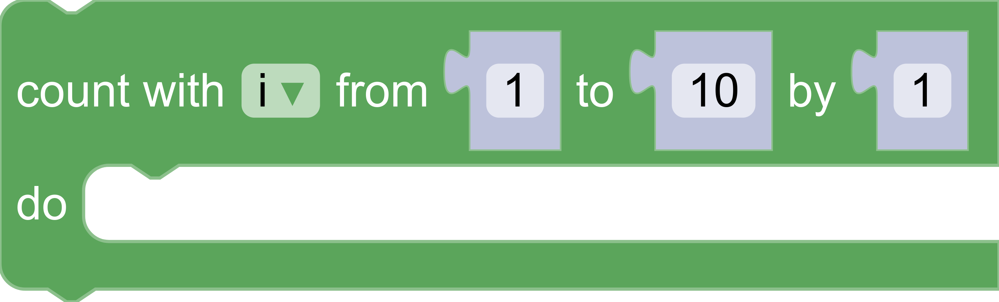
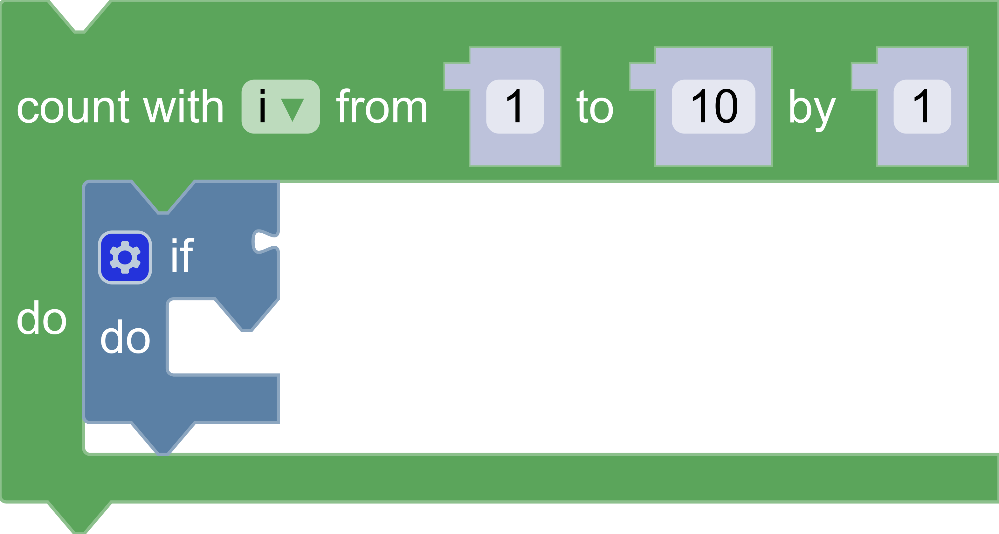

author: Rachel Fenichel
summary: Codelab to create a custom renderer
id: custom-renderer
categories: blockly,codelab,rendering,customization
status: Draft
Feedback Link: https://github.com/google/blockly-samples/issues/new

# Custom renderers

## Codelab overview

### What you'll learn
In this codelab you will learn:
1. How to define and register a custom renderer.
1. How to override renderer constants.
1. How to change the shape of connection notches.
1. How to set a connection's shape based on its type checks.

### What you'll build

Over the course of this codelab you will build and use four renderers.

1. A minimal custom renderer.

1. A renderer with custom constants.

1. A renderer with custom notches.

1. A renderer with connection shapes that depend on the type checks of each connection.


The code samples are written in ES5 syntax. You can find the code for the [completed custom renderer](https://github.com/google/blockly-samples/tree/master/codelabs/custom_renderer) on GitHub, in both ES5 and ES6 syntax.

### What you'll need
This codelab assumes that you are already comfortable with using the Blockly playground locally.  You can find it in `tests/playground.html`.

## Setup

In this codelab you will add code to the Blockly playground to create and use a new renderer. The playground contains all of Blockly's base blocks, as well as some that exist only to test rendering code. You can find the playground at `tests/playground.html`.

To start, create a file named `custom_renderer.js` in the same folder as the playground.  Include it with a script tag.

```
<script src="custom_renderer.js"></script>
```

Note: you must include your custom code *after* including the Blockly library.

## Define and register a renderer

A **Renderer** is the interface between your custom rendering code and the rest of Blockly. Blockly provides a base renderer with all required fields set to default values.

Your new renderer must extend the base renderer:
```js
CustomRenderer = function(name) {
  CustomRenderer.superClass_.constructor.call(this, name);
};
Blockly.utils.object.inherits(CustomRenderer,
    Blockly.blockRendering.Renderer);
```

After defining your renderer you need to tell Blockly that it exists. Register your renderer by name:
```js
Blockly.blockRendering.register('custom_renderer', CustomRenderer);
```

To use your custom renderer, set the `renderer` property in the configuration struct in `playground.html`:
```js
Blockly.inject('blocklyDiv', {
    renderer: 'custom_renderer'
  }
);
```

### The result

To test, open the playground in your browser and drag out a repeat block. The resulting block looks close to normal, but with slightly different alignment than Geras or Thrasos.


## Override constants

A **ConstantsProvider** holds all rendering-related constants.  This includes sizing information and colours.  Blockly provides a base **ConstantsProvider** with all required fields set to default values.

The **ConstantsProvider** constructor sets all static properties, such as `NOTCH_WIDTH` and `NOTCH_HEIGHT`. For a full list of properties, see [constants.js](https://github.com/google/blockly/blob/master/core/renderers/common/constants.js).

In general you will want to override a subset of the constants, rather than all of them. To do so:
- Define a constants provider that extends the base provider.
- Call the superclass constructor in your constructor.
- Set individual properties.

```js
CustomConstantsProvider = function() {
  // Set up all of the constants from the base provider.
  CustomConstantsProvider.superClass_.constructor.call(this);

  // Override a few properties.
  /**
   * The width of the notch used for previous and next connections.
   * @type {number}
   * @override
   */
  this.NOTCH_WIDTH = 20;

  /**
   * The height of the notch used for previous and next connections.
   * @type {number}
   * @override
   */
  this.NOTCH_HEIGHT = 10;

  /**
   * Rounded corner radius.
   * @type {number}
   * @override
   */
  this.CORNER_RADIUS = 2;
  /**
   * The height of the puzzle tab used for input and output connections.
   * @type {number}
   * @override
   */
  this.TAB_HEIGHT = 8;
};
Blockly.utils.object.inherits(CustomConstantsProvider,
    Blockly.blockRendering.ConstantProvider);
```

To use your new **ConstantsProvider**, you must override `makeConstants_` on your custom renderer:
```js
CustomRenderer.prototype.makeConstants_ = function() {
  return new CustomConstantsProvider();
};
```

### The result

The resulting block has triangular previous and next connections, and skinny input and output connections. Note that the general shapes of the connections have not changed--only parameters such as width and height.


## Understand connection shapes

A common use case of a custom renderer is changing the shape of connections. This requires a more detailed understanding of how a block is drawn and how SVG paths are defined.

### The block outline

The outline of the block is a single [SVG path](https://developer.mozilla.org/en-US/docs/Web/SVG/Element/path). The outline is built out of many sub-paths (e.g. the path for a previous connection; the path for the top of the block; and the path for an input connection).

Each sub-path is a string of [path commands](https://developer.mozilla.org/en-US/docs/Web/SVG/Attribute/d#Path_commands) that describe the appropriate shape. These commands must use relative (rather than absolute) coordinates.

While you can write SVG path commands as strings, Blockly provides a set of [utility functions](https://developers.google.com/blockly/reference/js/Blockly.utils.svgPaths) to make writing and reading paths easier.

### Connection shapes

A connection's shape is stored as an object with information about its width, height, and sub-path. These objects are created in the constant provider's `init` function:

```js
/**
 * Initialize shape objects based on the constants set in the constructor.
 * @package
 */
Blockly.blockRendering.ConstantProvider.prototype.init = function() {
  /**
   * An object containing sizing and path information about notches.
   * @type {!Object}
   */
  this.NOTCH = this.makeNotch();

  /**
   * An object containing sizing and path information about puzzle tabs.
   * @type {!Object}
   */
  this.PUZZLE_TAB = this.makePuzzleTab();

  // Additional code has been removed for brevity.
};
```

As a rule of thumb, **properties that are primitives should be set in the constructor, while objects should be set in `init`**. This separation allows a subclass to override a constant such as `NOTCH_WIDTH` and see the change reflected in objects that depend on the constant.

### `shapeFor`

The `shapeFor` function on a constants provider maps from connection to connection shape. Here is the default implementation, which returns a puzzle tab for input/output connections and a notch for previous/next connections:

```js
/**
 * Get an object with connection shape and sizing information based on the type
 * of the connection.
 * @param {!Blockly.RenderedConnection} connection The connection to find a
 *     shape object for
 * @return {!Object} The shape object for the connection.
 * @package
 */
Blockly.blockRendering.ConstantProvider.prototype.shapeFor = function(
    connection) {
  switch (connection.type) {
    case Blockly.INPUT_VALUE:
    case Blockly.OUTPUT_VALUE:
      return this.PUZZLE_TAB;
    case Blockly.PREVIOUS_STATEMENT:
    case Blockly.NEXT_STATEMENT:
      return this.NOTCH;
    default:
      throw Error('Unknown connection type');
  }
};
```

## Change connection shapes

In this step you will define and use new shapes for previous/next connections and input/output connections. This takes three steps:
1. Define new shape objects.
1. Override `init` to store the new shape objects.
1. Override `shapeFor` to return the new objects.

### Define a previous/next connection shape

The outline path is drawn clockwise around the block, starting at the top left. As a result the previous connection is drawn from left to right, while the next connection is drawn from right to left.

Previous and next connections are defined by the same object. The object has four properties:
- `width`: The width of the connection.
- `height`: The height of the connection.
- `pathLeft`: The sub-path that describes the connection when drawn from left to right.
- `pathRight`: The sub-path that describes the connection when drawn from right to left.

Define a new function called `makeRectangularPreviousConn`. Note that `NOTCH_WIDTH` and `NOTCH_HEIGHT` have already been overridden in the constructor.

```js
/**
 * Return a rectangular notch for use with previous and next connections.
 */
CustomConstantsProvider.prototype.makeRectangularPreviousConn = function() {
  var width = this.NOTCH_WIDTH;
  var height = this.NOTCH_HEIGHT;

  /**
   * Since previous and next connections share the same shape
   * you can define a function to generate the path for both.
   */
  function makeMainPath(dir) {
    return Blockly.utils.svgPaths.line(
        [
          Blockly.utils.svgPaths.point(0, height),
          Blockly.utils.svgPaths.point(dir * width, 0),
          Blockly.utils.svgPaths.point(0, -height)
        ]);
  }
  var pathLeft = makeMainPath(1);
  var pathRight = makeMainPath(-1);

  return {
    width: width,
    height: height,
    pathLeft: pathLeft,
    pathRight: pathRight
  };
};
```

### Define input/output connection shape

By the same logic input and output connections are drawn in two directions: top to bottom, and bottom to top. The object contains four properties:
- `width`
- `height`
- `pathUp`
- `pathDown`

Define a new function called `makeRectangularInputConn`:

```js
/**
 * Return a rectangular puzzle tab for use with input and output connections.
 */
CustomConstantsProvider.prototype.makeRectangularInputConn = function() {
  var width = this.TAB_WIDTH;
  var height = this.TAB_HEIGHT;

  /**
   * Since input and output connections share the same shape you can
   * define a function to generate the path for both.
   */
  function makeMainPath(up) {
    return Blockly.utils.svgPaths.line(
        [
          Blockly.utils.svgPaths.point(-width, 0),
          Blockly.utils.svgPaths.point(0, -1 * up * height),
          Blockly.utils.svgPaths.point(width, 0)
        ]);
  }

  var pathUp = makeMainPath(1);
  var pathDown = makeMainPath(-1);

  return {
    width: width,
    height: height,
    pathDown: pathDown,
    pathUp: pathUp
  };
};
```

### Override init

Override the `init` function and store the new objects as `RECT_PREV_NEXT` and `RECT_INPUT_OUTPUT`. Make sure you call the superclass `init` function to store other objects that you have not overridden.

```js
/**
 * @override
 */
CustomConstantsProvider.prototype.init = function() {
  CustomConstantsProvider.superClass_.init.call(this);
  // Add calls to create shape objects for the new connection shapes.
  this.RECT_PREV_NEXT = this.makeRectangularPreviousConn();
  this.RECT_INPUT_OUTPUT = this.makeRectangularInputConn();
};
```

### Override shapeFor

Next, override the `shapeFor` function and return your new objects:

```js
/**
 * @override
 */
CustomConstantsProvider.prototype.shapeFor = function(
    connection) {
  switch (connection.type) {
    case Blockly.INPUT_VALUE:
    case Blockly.OUTPUT_VALUE:
      return this.RECT_INPUT_OUTPUT;
    case Blockly.PREVIOUS_STATEMENT:
    case Blockly.NEXT_STATEMENT:
      return this.RECT_PREV_NEXT;
    default:
      throw Error('Unknown connection type');
  }
};
```

### The result

The resulting block has rectangular connections for all four connection types.


## Typed connection shapes

In this step we will create a renderer that sets connection shapes at runtime based on a connection's type checks. We will use the default connection shapes and the shapes defined in the previous steps.

### Override shapeFor

Override the shapeFor function to inspect the connection's type checks array and return the correct connection shape:
- Return a rectangular tab for inputs and outputs that accept numbers and strings.
- Return the default puzzle tab for other inputs and outputs.
- Return the normal notch for previous and next connections.

```js
/**
 * @override
 */
CustomConstantsProvider.prototype.shapeFor = function(connection) {
  var checks = connection.getCheck();
  switch (connection.type) {
    case Blockly.INPUT_VALUE:
    case Blockly.OUTPUT_VALUE:
      // Includes doesn't work in IE.
      if (checks && checks.indexOf('Number') != -1) {
        return this.RECT_INPUT_OUTPUT;
      }
      if (checks && checks.indexOf('String') != -1) {
        return this.RECT_INPUT_OUTPUT;
      }
      return this.PUZZLE_TAB;
    case Blockly.PREVIOUS_STATEMENT:
    case Blockly.NEXT_STATEMENT:
      return this.NOTCH;
    default:
      throw Error('Unknown type');
  }
};
```

### The result

In this screenshot, the number inputs and outputs are rectangular.  The boolean input on the if block is a puzzle tab.


## Summary

Custom renderers are a powerful way to change the look and feel of Blockly.  In this codelab you learned:
* You learned how to declare and register a custom renderer.
* How to replace a renderer's constant provider.
* How to override primitive constants, such as `NOTCH_HEIGHT`.
* How to define and use a complex constant, such as a connection shape.
* How to update the mapping from connection to connection shape.

You can find the code for the [completed custom renderer](https://github.com/google/blockly-samples/tree/master/codelabs/custom_renderer) on GitHub, in both ES5 and ES6 syntax.
