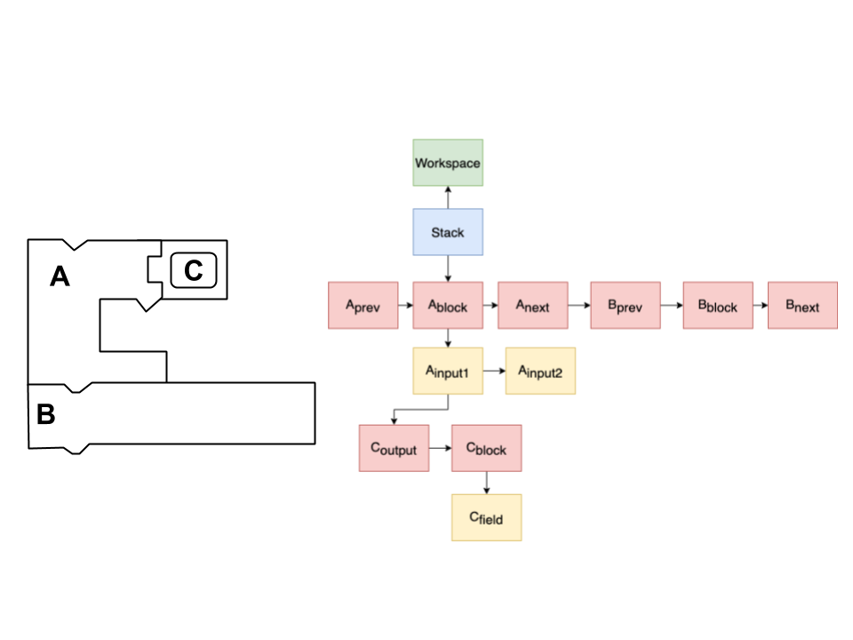
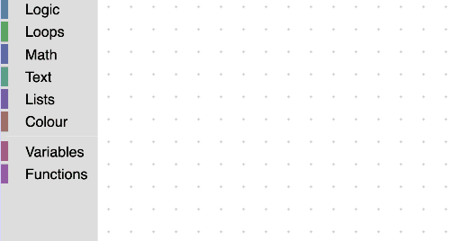
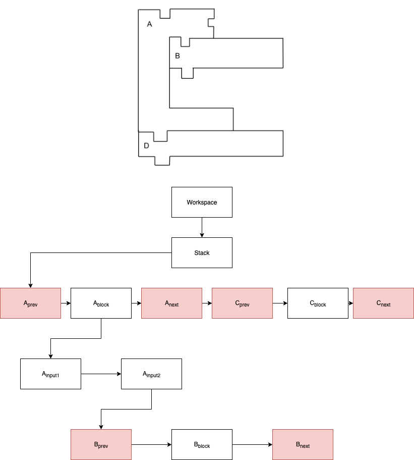
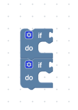
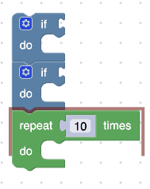

author: Abby Schmiedt
summary: Codelab to configure keyboard navigation
id: keyboard-navigation
categories: blockly,codelab,accessibility,keyboard navigation
status: Draft
Feedback Link: https://github.com/google/blockly-samples/issues/new

# Keyboard navigation

## Codelab overview
Keyboard navigation is the first step in making Blockly more accessible. This guide focuses on how to modify keyboard navigation for testing purposes. 

### Prerequisites
1. A basic understanding of how to use the Blockly playground locally. This can be found in [`tests/playground.html`](https://github.com/google/blockly/blob/master/tests/playground.html).
1. Read through the keyboard navigation [documentation](https://developers.google.com/blockly/guides/configure/web/keyboard-nav).

### What you'll learn
In this codelab you will learn:
1. How to change the behavior of a cursor.
1. How to change the look of cursors and markers.
1. How to add a shortcut.
1. How to change the current key mappings.

### What you'll build
Over the course of this codelab you will build the following:
1. A cursor that displays a red blinking image over the block.
1. A cursor that skips over previous and next connections.
1. A keyboard shortcut for moving your cursor to the top of a stack.

### What you'll need
1. A Blockly version greater than or equal to `5.20210325.0` and the [keyboard navigation plugin](https://www.npmjs.com/package/@blockly/keyboard-navigation).

## Terminology
A **Marker** holds a location and is not movable. 

A **Cursor** is a marker that can move. It extends a `Blockly.Marker` but adds logic to allow the marker to move through the blocks, inputs, fields, connections and workspace coordinates.

The below image displays different parts of a block that a user can navigate to using keyboard navigation.


## Setup
In this codelab you will add code to a Blockly playground that has the [keyboard navigation plugin](https://www.npmjs.com/package/@blockly/keyboard-navigation) initialized.
We will be using the playground created in the keyboard
navigation plugin, which can be found in [`tests/index.js`](https://github.com/google/blockly-samples/blob/master/plugins/keyboard-navigation/test/index.js). 

To get the playground up and working follow these steps:
1. Clone the [blockly-samples](https://github.com/google/blockly-samples) repository.
1. Move to the [plugins/keyboard-navigation](https://github.com/google/blockly-samples/blob/master/plugins/keyboard-navigation/README.md) directory.
1. Run `npm install`.
1. Run `npm run start`.

If you would rather not pull the blockly-samples repository, you should also
be able to follow along by creating a simple Blockly application that
uses the keyboard navigation plugin.

To start, create a file named `custom_cursor.js` and a file named `custom_marker_svg.js` in the same folder as [`test/index.js`](https://github.com/google/blockly-samples/blob/master/plugins/keyboard-navigation/test/index.js).

Note: you must include your custom code *after* including the Blockly library.

## Define and set a cursor
We extend `Blockly.Cursor` to make our new cursor. Add the following code to your `custom_cursor.js` file.
```js
export class CustomCursor extends Blockly.Cursor {
  constructor() {
    super();
  }
}
```

Import your cursor in `test/index.js`.

```js
import {CustomCursor} from './custom_cursor';
```

Tell the workspace to use your new cursor.
In `test/index.js` after the workspace is initialized in `createWorkspace` call `setCursor` on the `markerManager`.
```js
workspace.getMarkerManager().setCursor(new CustomCursor());
```

## Understand AST Nodes 
When designing keyboard navigation we needed a way to organize all the different components in a workspace in a structured way. Our solution was to represent the workspace and its components as an abstract syntax tree ([AST](https://en.wikipedia.org/wiki/Abstract_syntax_tree)).

The below image displays the AST for a workspace.


There are four different levels to the AST:
1. Workspace Level (green): Holds all workspace nodes.
1. Stack Level (blue): Holds all stack nodes.
1. Block and Connection Level (red): Holds all block and connection nodes.
1. Field and Input Level (yellow): Holds all field and input nodes.

For a more detailed explanation of the different levels please see the [keyboard navigation documentation](https://developers.google.com/blockly/guides/configure/web/keyboard-nav#using_the_default_cursor).


### Create AST nodes
The `Blockly.ASTNode` class is used to represent the AST. `Blockly.ASTNode`s hold a workspace component. This component can be a block, connection, field, input or workspace coordinate.

The below code shows how to create a `Blockly.ASTNode` for the different workspace components.
```js
const workspaceNode = Blockly.ASTNode.createWorkspaceNode(workspace, wsCoordinate);
const stackNode = Blockly.ASTNode.createStackNode(topBlock);
const connectionNode = Blockly.ASTNode.createConnectionNode(connection);
const blockNode = Blockly.ASTNode.createBlockNode(block);
const fieldNode = Blockly.ASTNode.createFieldNode(field);
const inputNode = Blockly.ASTNode.createInputNode(input);
```
### Use AST nodes
We use these nodes in our cursor to decide where to go and what to draw.

Every node can: 
1. Return the node below it (`in()`)
1. Return the node above it (`out()`)
1. Return the previous node (`prev()`)
1. Return the next node (`next()`)

For example, you can use the below code to get the stack node from a workspace node.
```js
const stackNode = workspaceNode.in();
```

## Change the marker look
The `Blockly.blockRendering.MarkerSvg` class contains the logic to draw cursors and markers. The  `Blockly.blockRendering.MarkerSvg` class decides what to draw depending on the current node the cursor or marker holds.  

Create a new custom marker that will change the look of cursors and markers when they are on a block.

### Create a custom marker svg
Add the below code to your `custom_marker_svg.js` file.
Create a new class that extends `Blockly.blockRendering.MarkerSvg`. 
```js
class CustomMarkerSvg extends Blockly.blockRendering.MarkerSvg {
  constructor(workspace, constants, marker) {
    super(workspace, constants, marker);
  }
}
```

In the class you just created, override `createDomInternal_`. This method is in charge of creating all dom elements for the marker. Add a new path element for when the cursor is on a block.
```js
  /**
   * @override
   */
  createDomInternal_() {
    super.createDomInternal_();

    // Create the svg element for the marker when it is on a block and set the parent to markerSvg_.
    this.blockPath_ = Blockly.utils.dom.createSvgElement('path', {}, this.markerSvg_);

    // If this is a cursor make the cursor blink.
    if (this.isCursor()) {
      const blinkProperties = this.getBlinkProperties_();
      Blockly.utils.dom.createSvgElement('animate', blinkProperties,
          this.blockPath_);
    }
  }
```

Create a method that will update the path of `blockPath_` when we move
to a new block.
```js
  /**
   * @override
   */
  showWithBlock_(curNode) {
    // Get the block from the AST Node
    const block = curNode.getLocation();
    // Get the path of the block.
    const blockPath = block.pathObject.svgPath.getAttribute('d');
    // Set the path for the cursor.
    this.blockPath_.setAttribute('d', blockPath);

    // Set the current marker.
    this.currentMarkerSvg = this.blockPath_;
    // Set the parent of the cursor as the block.
    this.setParent_(block);
    // Show the current marker.
    this.showCurrent_();
  }
```

Override `showAtLocation_`. This method is used to decide what to display at a given node.
```js
  /**
   * @override
   */
  showAtLocation_(curNode) {
    let handled = false;
    // If the cursor is on a block call the new method we created to draw the cursor.
    if (curNode.getType() == Blockly.ASTNode.types.BLOCK) {
      this.showWithBlock_(curNode);
      handled = true;
    }

    // If we have not drawn the cursor let the parent draw it.
    if (!handled) {
      super.showAtLocation_.call(this, curNode);
    }
  }
```

Override the `hide` method.
```js
  /**
   * @override
   */
  hide() {
    super.hide();
    // Hide the marker we created.
    this.blockPath_.style.display = 'none';
  }
```

### Renderer setup
In order to have the cursor use `CustomMarkerSvg` we need to
override the renderer. For more information on customizing a renderer see the
custom renderer [codelab](https://blocklycodelabs.dev/codelabs/custom-renderer/index.html?index=..%2F..index#2).

Add the below code to your `custom_marker_svg.js` file. 
```js
class CustomRenderer extends Blockly.geras.Renderer {
  constructor(name) {
    super(name);
  }
}
Blockly.blockRendering.register('custom_renderer', CustomRenderer);
```

Now we need to override the method responsible for returning the drawer for markers and cursors.
Add the following method in the `CustomRenderer` class.
```js
makeMarkerDrawer(workspace, marker) {
  return new CustomMarkerSvg(workspace, this.getConstants(), marker);
}
```

In order to use your custom renderer, import it and set the renderer property in `index.js`.

```js
import './custom_marker_svg';
```

Pass the renderer name to the default options in the 'DomContentLoaded' event listener.
```js
  const defaultOptions = {
    toolbox: toolboxCategories,
    renderer: 'custom_renderer',
  };
```

### Test it out
Open the playground and drag a function block on to your workspace. Press **ctrl + shift + k** to enter into keyboard navigation mode. Notice how the entire block starts flashing red.


## Change the cursor behavior

### Override the move methods
In order to create a cursor that skips over previous and next connections override the methods that move the cursor. 

Add the below code to your `custom_cursor.js` file.
```js

next() {
  // The current Blockly.ASTNode the cursor is on.
  const curNode = this.getCurNode();
  if (!curNode) {
    return null;
  }
  // The next Blockly.ASTNode.
  let newNode = curNode.next();
  if (newNode) {
    // This in charge of updating the current location and drawing the cursor.
    this.setCurNode(newNode);
  }
  return newNode;
}

in() {
  const curNode = this.getCurNode();
  if (!curNode) {
    return null;
  }
  let newNode = curNode.in();
  if (newNode) {
    this.setCurNode(newNode);
  }
  return newNode;
}

prev() {
  const curNode = this.getCurNode();
  if (!curNode) {
    return null;
  }
  let newNode = curNode.prev();
  if (newNode) {
    this.setCurNode(newNode);
  }
  return newNode;
}

out() {
  const curNode = this.getCurNode();
  if (!curNode) {
    return null;
  }
  let newNode = curNode.out();
  if (newNode) {
    this.setCurNode(newNode);
  }
  return newNode;
}
```

### Modify the move methods
Add logic to the move methods to skip over the previous and
next connections. We can reference the below image as we add logic to the
move methods. The red boxes represent the nodes we want to skip.



Change the `next` method so it will skip over any previous or next connections.
```js
next() {
  const curNode = this.getCurNode();
  if (!curNode) {
    return null;
  }
  let newNode = curNode.next();
  // While the newNode exists and is either a previous or next type go to the
  // next value.
  while (newNode && (newNode.getType() === Blockly.ASTNode.types.PREVIOUS ||
      newNode.getType() === Blockly.ASTNode.types.NEXT)) {
    newNode = newNode.next();
  }
  if (newNode) {
    this.setCurNode(newNode);
  }
  return newNode;
}
```

Change the `prev` method so it will skip over any previous or next connections.
```js
prev() {
  const curNode = this.getCurNode();
  if (!curNode) {
    return null;
  }
  let newNode = curNode.prev();
  // While the newNode exists and is either a previous or next connection go to
  // the previous value.
  while (newNode && (newNode.getType() === Blockly.ASTNode.types.PREVIOUS ||
      newNode.getType() === Blockly.ASTNode.types.NEXT)) {
    newNode = newNode.prev();
  }
  if (newNode) {
    this.setCurNode(newNode);
  }
  return newNode;
}
```

Change the `in` method so that it will skip over any previous connections and go straight to the block. 
```js
in() {
  const curNode = this.getCurNode();
  if (!curNode) {
    return null;
  }
  let newNode = curNode.in();
  // If the newNode is a previous connection go to the next value in the level. 
  // This will be the block.
  if (newNode && newNode.getType() === Blockly.ASTNode.types.PREVIOUS) {
    newNode = newNode.next();
  }
  if (newNode) {
    this.setCurNode(newNode);
  }
  return newNode;
}
```

#### Test it out
Open the playground and enter into keyboard navigation mode (**ctrl + shift + k**). Drag some blocks
on to the workspace and navigate to the first block. From here hit the **S** key
to go to the next block. Notice how the cursor skips over the previous and next
connection and goes straight to the next block.



## Add a shortcut
In this section we will add a shortcut that will allow users to move their cursor
to the top of their current stack by pressing **ctrl + W**.

### Create a shortcut
First, we will create our shortcut.

A shortcut has several properties:
- `name`: The name of the shortcut. This must be unique.
- `preconditionFn`: A function that returns true if the shortcut should be run,
false otherwise.
- `callback`: A function called when the shortcut has been executed. This should
return true if the shortcut has been handled. If a shortcut has been handled, no
other shortcuts with the same key mapping will be handled.
- `keyCodes`: A list of key codes that when pressed will trigger this
shortcut. (Only available in version of Blockly >= 9.)

Our below shortcut is set up to only run when the user is in keyboard navigation
mode. Add the below code in `index.js`.
```js
let moveToStack = {
  name: 'moveToStack',
  preconditionFn: function(workspace) {
    return workspace.keyboardAccessibilityMode;
  },
  callback: function(workspace) {
    const cursor = workspace.getCursor();
    // Gets the current node.
    const currentNode = cursor.getCurNode();
    // Gets the source block from the current node.
    const currentBlock = currentNode.getSourceBlock();
    // If we are on a workspace node there will be no source block.
    if (currentBlock) {
      // Gets the top block in the stack.
      const rootBlock = currentBlock.getRootBlock();
      // Gets the top node on a block. This is either the previous connection,
      // output connection, or the block itself.
      const topNode = Blockly.ASTNode.createTopNode(rootBlock);
      // Update the location of the cursor.
      cursor.setCurNode(topNode);
      return true;
    }
  },
};
```
Once we have created the shortcut, we can now register it. Add the below code
to your `index.js` after you have created your shortcut.
```js
Blockly.ShortcutRegistry.registry.register(moveToStack);
```

### Adding a key mapping
Now that we have registered our shortcut, we can add key mappings. A key mapping is
a mapping from a key code or combination of key codes to a shortcut. When the
key code or combination of key codes have been pressed the shortcut will run.

We can combine primary keys with modifier keys by using the `createSerializedKey`
method. A list of the available modifier keys are:
1. `Blockly.ShortcutRegistry.modifierKeys.SHIFT`
1. `Blockly.ShortcutRegistry.modifierKeys.CONTROL`
1. `Blockly.ShortcutRegistry.modifierKeys.ALT`
1. `Blockly.ShortcutRegistry.modifierKeys.META`

For our example we will create a key code for control W by using the below code.
Add the following code to your `index.js` file.
```js
// Create a serialized key from the primary key and any modifiers.
const ctrlW = Blockly.ShortcutRegistry.registry.createSerializedKey(
    Blockly.utils.KeyCodes.W, [Blockly.ShortcutRegistry.modifierKeys.Control]);
```

Once the serialized key has been created, we can then add a key mapping for
the 'moveToStack' shortcut. Add the below code to
the `index.js` file after we have registered our shortcut.
```js
Blockly.ShortcutRegistry.registry.addKeyMapping(ctrlW, 'moveToStack');
```

As of version 9 of Blockly you can also add this key mapping when you first
create the keyboard shortcut by adding a keyCodes property to your shortcut
object. 

```js
const moveToStack = {
  ...
  keyCodes: [ctrlW]
};
```

### Test it out
Open the playground and create a stack of blocks. Enter keyboard navigation
mode by pressing **shift + control + K**. Move your cursor down a few
blocks and then press **ctrl + W**. Notice how the cursor jumps to the top of
the stack of blocks.



## Change current key mappings
In this section, we update our key mappings so we can use the arrow
keys for our cursor instead of the **WASD** keys. 

Before adding the key mappings below, import the shortcut names by adding the
following line to your `index.js` file.

```js
import {Constants} from '../src/index';
```

In `index.js` we set the keys for the next, previous, in and out actions. For a
full list of the shortcuts registered in the keyboard navigation plugin see the
[constants file](https://github.com/google/blockly-samples/blob/35edbc9d7b882ec9a24ff0811e1e255f5d565fe8/plugins/keyboard-navigation/src/constants.js#L31).
```js
Blockly.ShortcutRegistry.registry.removeAllKeyMappings(Constants.SHORTCUT_NAMES.OUT);
Blockly.ShortcutRegistry.registry.addKeyMapping(Blockly.utils.KeyCodes.LEFT, Constants.SHORTCUT_NAMES.OUT);

Blockly.ShortcutRegistry.registry.removeAllKeyMappings(Constants.SHORTCUT_NAMES.IN);
Blockly.ShortcutRegistry.registry.addKeyMapping(Blockly.utils.KeyCodes.RIGHT, Constants.SHORTCUT_NAMES.IN);

Blockly.ShortcutRegistry.registry.removeAllKeyMappings(Constants.SHORTCUT_NAMES.PREVIOUS);
Blockly.ShortcutRegistry.registry.addKeyMapping(Blockly.utils.KeyCodes.UP, Constants.SHORTCUT_NAMES.PREVIOUS);

Blockly.ShortcutRegistry.registry.removeAllKeyMappings(Constants.SHORTCUT_NAMES.NEXT)
Blockly.ShortcutRegistry.registry.addKeyMapping(Blockly.utils.KeyCodes.DOWN, Constants.SHORTCUT_NAMES.NEXT)
```
### Test it out
Open the playground and enter keyboard navigation mode (**ctrl + shift + k**). You can now use the arrow
keys to move around instead of the **WASD** keys.

## Summary
There is still a lot of work to be done in figuring out the best way to provide
keyboard navigation support for users. Hopefully, everything you learned in this
codelab will help you test out any ideas you have.
In this codelab you learned:
* How to create a new cursor
* How to change the look of markers and cursors
* How to add shortcuts
