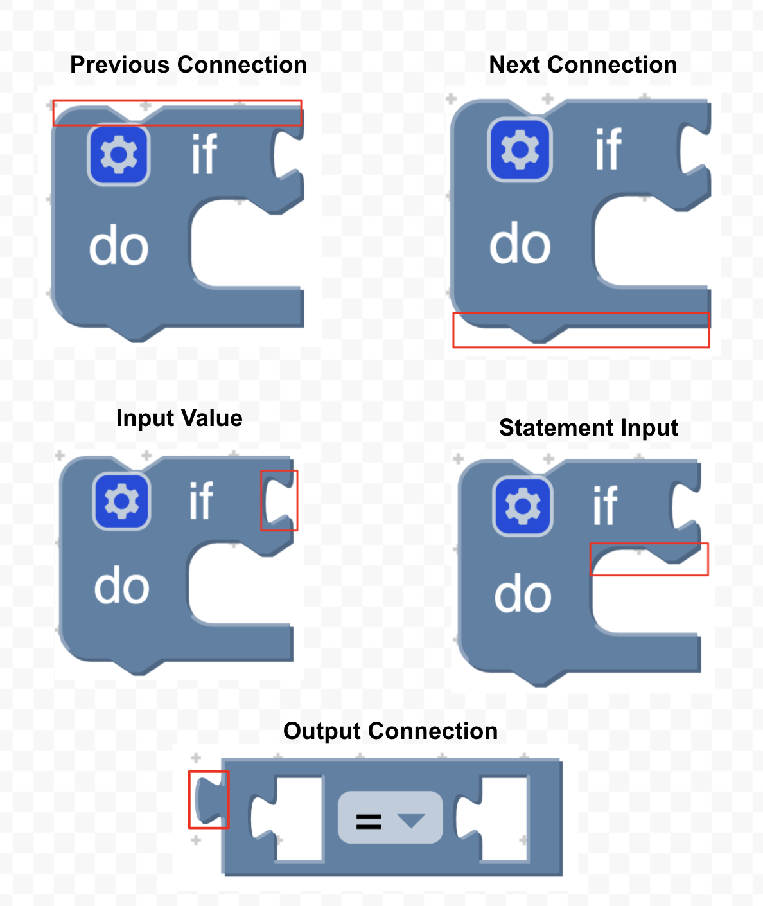

author: Abby Schmiedt
summary: Codelab to configure keyboard navigation
id: keyboard-navigation
categories: blockly,codelab,accessibility,keyboard navigation
status: Draft
Feedback Link: https://github.com/google/blockly-samples/issues/new

# Keyboard navigation

## Codelab overview

### What you'll learn
In this codelab you will learn:
1. How to add a shortcut.
1. How to change how the cursor looks.
1. How to change how the cursor behaves.

### What you'll build

Over the course of this codelab you will build the following.

1. A keyboard shortcut for moving your cursor to the top of a stack.
1. A cursor that skips over the next connection of a block if it is connected.
1. A cursor that displays a notch for the next connection.

### What you'll need
This codelab assumes that you are already comfortable with using the Blockly playground locally.  You can find it in `tests/playground.html`. And have read through the keyboard navigation [documentation](https://developers.google.com/blockly/guides/configure/web/keyboard-nav).

## Terminology
A **Marker** holds a location and is not movable.

A **Cursor** is a marker that can move. It extends marker but adds other logic
to allow the marker to move through the blocks, inputs, fields, connections and
workspace coordinates.



## Setup

In this codelab you will add code to the Blockly playground to create and use a new cursor. You can find the playground at `tests/playground.html`.

To start, create a file named `custom_cursor.js` in the same folder as the playground.  Include it with a script tag.

```
<script src="custom_cursor.js"></script>
```

Note: you must include your custom code *after* including the Blockly library.


## Define and set a cursor

```js
CustomCursor = function() {
  CustomCursor.superClass_.constructor.call(this);
};
Blockly.utils.object.inherits(CustomCursor, Blockly.Cursor);
```

After defining your renderer you need to tell the workspace to use your new cursor.
In the Blockly playground after the workspace is initialized call `setCursor`
on the `markerManager`.
```js
workspace.markerManager().setCursor(new CustomCursor());
```

### The result

To test, open the playground in your browser and enter keyboard navigation mode
by pressing Control + Shift + k. The cursor should move around the same
as before.


## Add a shortcut
In this section we are going to add a shortcut to allow users to move their
cursor to the top of the stack their cursor is currently on.

First, we must create a serialized key code from the primary key and the desired
modifier keys. The possible modifier keys are: 
1. `Blockly.user.keyMap.modifierKeys.SHIFT`
1. `Blockly.user.keyMap.modifierKeys.CONTROL`
1. `Blockly.user.keyMap.modifierKeys.ALT`
1. `Blockly.user.keyMap.modifierKeys.META`

For this example we are going to set up Shift + T to move the cursor to the top
of the stack of blocks. Add the below code to the `playground.html` file after
we have set the cursor.

```js
  // Create a serialized key from the primary key and any modifiers.
  var shiftT = Blockly.user.keyMap.createSerializedKey(
      Blockly.utils.KeyCodes.T, [Blockly.user.keyMap.modifierKeys.SHIFT]);  
```

We need to create our action. A `Blockly.Action` describes a users intent.
Give the action a name and a short description of what it does.

```js
  var actionTopOfStack = new Blockly.Action('topOfStack', 'Move cursor to top of stack');
```

We need to bind the action and the key code.

```js
  Blockly.user.keyMap.setActionForKey(shiftT, actionTopOfStack);
```

Now when the user hits shift + T and is in keyboard navigation mode we will get a
'topOfStack' action. We can now handle this action inside of our cursor by
overriding `onBlocklyAction`. Add the below code to the `custom_cursor.js` file.
```js
CustomCursor.prototype.onBlocklyAction = function(action) {
  var handled = CustomCursor.superClass_.onBlocklyAction.call(this, action);
  // Don't handle if the parent class has already handled the action.
  if (!handled && action.name === 'topOfStack') {
    // Gets the current node.
    var currentNode = this.getCurNode();
    // Gets the source block from the current node.
    var currentBlock = currentNode.getSourceBlock();
    // If we are on a workspace node there will be no source block.
    if (currentBlock) {
      // Gets the top block in the stack.
      var rootBlock = currentBlock.getRootBlock();
      // Gets the top node on a block. This is either the previous connection,
      // output connection, or the block itself.
      var topNode = Blockly.navigation.getTopNode(rootBlock);
      // Update the location of the cursor.
      this.setCurNode(topNode);
    }
  }
};
```

### The result
Open the playground and create a stack of blocks. Move your cursor down a few
blocks. And then press shift + T. Notice how the cursor jumps to the top of the
stack of blocks.


## Change Cursor Behavior

### Understanding AST Nodes 
When thinking about keyboard navigation we needed a structured way to think about all
the different blocks, connections, fields, inputs and workspace coordinates. We decided to represent this as an abstract syntax tree(AST).

The below image displays the abstract syntax tree for a stack of blocks. There are four different levels: 
1. Workspace Level (red)
1. Stack Level (orange)
1. Block and Connection Level (yellow)
1. Field and Input Level (green)

To work with the AST we created an AST Nodes class. AST Nodes wrap blocks, connections, fields, inputs or workspace coordinates.

The below code shows how to create ASTNodes for the different types.
```js
const wsNode = Blockly.ASTNode.createWorkspaceNode(workspace, wsCoordinate);
const topBlock = Blockly.ASTNode.createStackNode(topBlock);
const connectionNode = Blockly.ASTNode.createConnectionNode(connection);
const blockNode = Blockly.ASTNode.createBlockNode(block);
const fieldNode = Blockly.ASTNode.createFieldNode(field);
const inputNode = Blockly.ASTNode.createInputNode(input);
```

Every node has the ability to go: 
1. in: Goes in a level
1. out: Goes out a level
1. prev: Goes to previous value within a level
1. next: Goes to next value within a level

For example, to get to the first stack on the workspace using the wsNode we
would use the below code.
```js
const stackNode = wsNode.in();
```

We can use these nodes in our cursor in order to decide where we should go
next.


### Override move methods

We want our CustomCursor to ...
To accomplish this we must first override the methods in charge of moving the cursor.

Add the below code to your `CustomCursor.js` file.
```js
CustomCursor.prototype.next = function() {
  // The current ASTNode the cursor is on.
  var curNode = this.getCurNode();
  if (!curNode) {
    return null;
  }
  // The next ASTNode in the same level.
  var newNode = curNode.next();
  if (newNode) {
    // This in charge of updating the current location and drawing the cursor.
    this.setCurNode(newNode);
  }
  return newNode;
};

CustomCursor.prototype.in = function() {
  var curNode = this.getCurNode();
  if (!curNode) {
    return null;
  }
  var newNode = curNode.in();
  if (newNode) {
    this.setCurNode(newNode);
  }
  return newNode;
};

CustomCursor.prototype.prev = function() {
  var curNode = this.getCurNode();
  if (!curNode) {
    return null;
  }
  var newNode = curNode.prev();
  if (newNode) {
    this.setCurNode(newNode);
  }
  return newNode;
};

CustomCursor.prototype.out = function() {
  var curNode = this.getCurNode();
  if (!curNode) {
    return null;
  }
  var newNode = curNode.out();
  if (newNode) {
    this.setCurNode(newNode);
  }
  return newNode;
};
```

### Modify Move Methods

#### The result

## Change the marker svg
TODO: ADD BACKGROUND

Our default cursor skips over blocks if a previous connection exists. The new
cursor we have created does not skip over blocks. We are going to update the
cursors svg so it looks different when we are on a block.

First we need to define our new custom marker svg. 
```js
CustomMarkerSvg = function(workspace, constants, marker) {
  CustomMarkerSvg.superClass_.constructor.call(
      this, workspace, constants, marker);
};
Blockly.utils.object.inherits(CustomMarkerSvg,
    Blockly.blockRendering.MarkerSvg);
```
Next we can override the method in chare


## Summary
There is still a lot of work to be done in figuring out the best way to provide
keyboard navigation support for users. Hopefully, everything you learned in this
codelab will help you test out any ideas or assumptions you have.
In this codelab you learned: 
* How to create a new cursor
* How to change the look of markers and cursors
* How to add shortcuts 
* How to add audio support 

