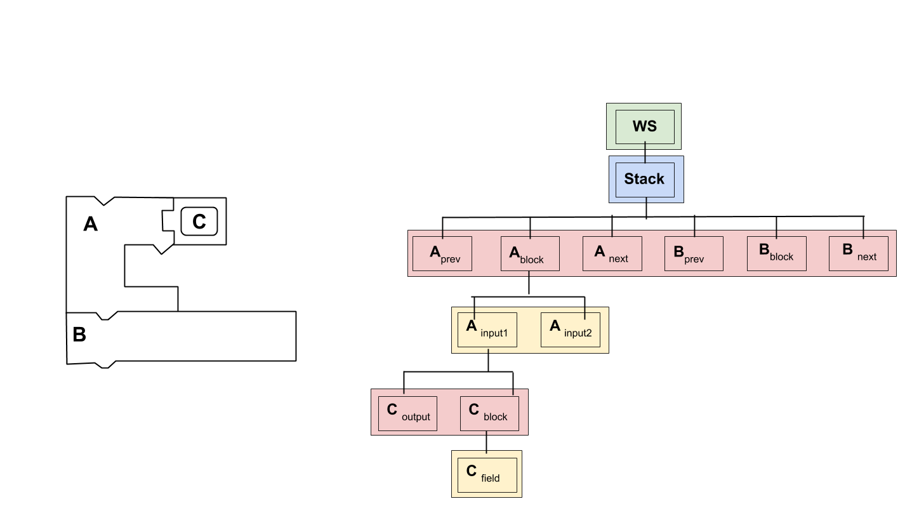

author: Abby Schmiedt
summary: Codelab to configure keyboard navigation
id: keyboard-navigation
categories: blockly,codelab,accessibility,keyboard navigation
status: Draft
Feedback Link: https://github.com/google/blockly-samples/issues/new

# Keyboard navigation

## Codelab overview
Keyboard navigation is a first step in making Blockly more accessible. This guide focuses on how to modify keyboard navigation for testing purposes. 

### Prerequisites
1. A basic understanding of how to use the Blockly playground locally. This can be found in `tests/playground.html`.
1. Read through the keyboard navigation [documentation](https://developers.google.com/blockly/guides/configure/web/keyboard-nav).

### What you'll learn
In this codelab you will learn:
1. How to change the behavior of a cursor.
1. How to change the look of cursors and markers.
1. How to add a shortcut.
1. How to change the current key mappings.

### What you'll build
Over the course of this codelab you will build the following.
1. A cursor that skips over previous and next connections.
1. A cursor that displays a red blinking image over the block.
1. A keyboard shortcut for moving your cursor to the top of a stack.

### What you'll need
1. A Blockly version greater than or equal to `3.20200123.0`.

## Terminology
A **Marker** holds a location and is not movable. 

A **Cursor** is a marker that can move. It extends a `Blockly.Marker` but adds logic to allow the marker to move through the blocks, inputs, fields, connections and workspace coordinates.


## Setup
In this codelab you will add code to the Blockly playground to create and use a new cursor. You can find the playground at `tests/playground.html`.

To start, create a file named `custom_cursor.js` and a file named `custom_marker_svg.js` in the same folder as the playground.  Include both files with a script tag.

```
<script src="custom_cursor.js"></script>
<script src="custom_marker_svg.js"></script>
```

Note: you must include your custom code *after* including the Blockly library.

## Define and set a cursor
Create a new cursor. Blockly provides a default cursor that provides some default functionality. 

Your new cursor must extend the base cursor. In your `custom_cursor.js` file add the following code.
```js
CustomCursor = function() {
  CustomCursor.superClass_.constructor.call(this);
};
Blockly.utils.object.inherits(CustomCursor, Blockly.Cursor);
```

Tell the workspace to use your new cursor.
In the Blockly playground after the workspace is initialized call `setCursor` on the `markerManager`.
```js
workspace.getMarkerManager().setCursor(new CustomCursor());
```

### The result
To test, open the playground in your browser and enter keyboard navigation mode by pressing **ctrl+shift+k**. The cursor should move around the same as before.

## Understand AST Nodes 
When thinking about keyboard navigation we needed a structured way to think about
the different blocks, connections, fields, inputs and workspace coordinates. We decided to represent this as an abstract syntax tree(AST).

There are four different levels to the AST:
1. Workspace Level (green)
1. Stack Level (blue)
1. Block and Connection Level (red)
1. Field and Input Level (yellow)

The below image displays the AST for a workspace.


To work with the AST we created the `Blockly.ASTNode` class. AST Nodes wrap blocks, connections, fields, inputs or workspace coordinates.

### Create AST nodes
The below code shows how to create AST Nodes for the different types.
```js
const workspaceNode = Blockly.ASTNode.createWorkspaceNode(workspace, wsCoordinate);
const stackNode = Blockly.ASTNode.createStackNode(topBlock);
const connectionNode = Blockly.ASTNode.createConnectionNode(connection);
const blockNode = Blockly.ASTNode.createBlockNode(block);
const fieldNode = Blockly.ASTNode.createFieldNode(field);
const inputNode = Blockly.ASTNode.createInputNode(input);
```
### Use AST nodes
We use these nodes in our cursor in order to decide where to go and what to draw.

Every node has the ability to go: 
1. in: Goes in a level
1. out: Goes out a level
1. prev: Goes to previous value within a level
1. next: Goes to next value within a level

For example, to get to the first stack on the workspace using a workspace node we would use the below code.
```js
const stackNode = workspaceNode.in();
```

## Change the marker svg
The `marker_svg.js` file is in charge of drawing cursors and markers depending on the current node type.

We are going to create a new custom marker that will change the look of cursors and markers when they are on a block.

Create a new marker svg class that extends `Blockly.blockRendering.MarkerSvg`. 
Add the below code to the `custom_marker_svg.js` file.
```js
CustomMarkerSvg = function(workspace, constants, marker) {
  CustomMarkerSvg.superClass_.constructor.call(
      this, workspace, constants, marker);
};
Blockly.utils.object.inherits(CustomMarkerSvg,
    Blockly.blockRendering.MarkerSvg);
```

Override `createDomInternal_`. This method is in charge of creating all dom elements for the marker. We are going to add a new path element for when the cursor is on a block.
```js
CustomMarkerSvg.prototype.createDomInternal_ = function() {
  CustomMarkerSvg.superClass_.createDomInternal_.call(this);
  // Create the svg element for the marker when it is on a block and set the parent to markerSvg_.
  this.markerBlock_ = Blockly.utils.dom.createSvgElement('path', {}, this.markerSvg_);

  // If this is a cursor make the cursor blink.
  if (this.isCursor()) {
    var blinkProperties = this.getBlinkProperties_();
    Blockly.utils.dom.createSvgElement('animate', blinkProperties,
        this.markerBlock_);
  }
};
```

Create a method that will update the path of `markerBlock_` when we move
to a new block.
```js
CustomMarkerSvg.prototype.showWithBlock_ = function(curNode) {
  // Get the block from the AST Node
  var block =curNode.getLocation();
  // Get the path of the block.
  var blockPath = block.pathObject.svgPath.getAttribute('d');
  // Set the path for the cursor.
  this.markerBlock_.setAttribute('d', blockPath);

  // Set the current marker.
  this.currentMarkerSvg = this.markerBlock_;
  // Set the parent of the cursor as the block.
  this.setParent_(block);
  // Show the current marker.
  this.showCurrent_();
};
```

Override the method used to decide what to display at a given node.
```js
CustomMarkerSvg.prototype.showAtLocation_ = function(curNode) {
  var handled = false;
  // If the cursor is on a block call the new method we created to draw the cursor.
  if (curNode.getType() == Blockly.ASTNode.types.BLOCK) {
    this.showWithBlock_(curNode);
    handled = true;
  }

  // If we have not drawn the cursor let the parent draw it.
  if (!handled) {
    CustomMarkerSvg.superClass_.showAtLocation_.call(this, curNode);
  }
};
```

Override the hide method.
```js
CustomMarkerSvg.prototype.hide = function() {
  CustomMarkerSvg.superClass_.hide.call(this);
  // Hide the marker we created.
  this.markerBlock_.style.display = 'none';
};
```

### The result
Open the playground and drag a function block on to your workspace. Enter
keyboard navigation mode by pressing **ctrl+shift+k**. Notice how your entire
block is flashing red.


## Change Cursor Behavior

### Override the move methods
In order to create a cursor that skips over previous and next connections we are
first going to override the methods that move the cursor. 

Add the below code to your `custom_cursor.js` file.
```js
CustomCursor.prototype.next = function() {
  // The current Blockly.ASTNode the cursor is on.
  var curNode = this.getCurNode();
  if (!curNode) {
    return null;
  }
  // The next Blockly.ASTNode.
  var newNode = curNode.next();
  if (newNode) {
    // This in charge of updating the current location and drawing the cursor.
    this.setCurNode(newNode);
  }
  return newNode;
};

CustomCursor.prototype.in = function() {
  var curNode = this.getCurNode();
  if (!curNode) {
    return null;
  }
  var newNode = curNode.in();
  if (newNode) {
    this.setCurNode(newNode);
  }
  return newNode;
};

CustomCursor.prototype.prev = function() {
  var curNode = this.getCurNode();
  if (!curNode) {
    return null;
  }
  var newNode = curNode.prev();
  if (newNode) {
    this.setCurNode(newNode);
  }
  return newNode;
};

CustomCursor.prototype.out = function() {
  var curNode = this.getCurNode();
  if (!curNode) {
    return null;
  }
  var newNode = curNode.out();
  if (newNode) {
    this.setCurNode(newNode);
  }
  return newNode;
};
```

### Modify the move methods
We are now going to add logic to the move methods to skip over the previous and
next connections. We can use the below image as reference as we add logic to the
move methods. The red boxes represent the nodes we are planning on skipping.


Change the `next` method so it will skip over any previous or next connections.
```js
CustomCursor.prototype.next = function() {
  var curNode = this.getCurNode();
  if (!curNode) {
    return null;
  }
  var newNode = curNode.next();
  // While the newNode exists and is either a previous or next type go to the
  // next value.
  while (newNode && (newNode.getType() === Blockly.ASTNode.types.PREVIOUS ||
      newNode.getType() === Blockly.ASTNode.types.NEXT)) {
    newNode = newNode.next();
  }
  if (newNode) {
    this.setCurNode(newNode);
  }
  return newNode;
};
```

Change the `prev` method so it will skip over any previous or next connections.
```js
CustomCursor.prototype.prev = function() {
  var curNode = this.getCurNode();
  if (!curNode) {
    return null;
  }
  var newNode = curNode.prev();
  // While the newNode exists and is either a previous or next connection go to
  // the previous value.
  while (newNode && (newNode.getType() === Blockly.ASTNode.types.PREVIOUS ||
      newNode.getType() === Blockly.ASTNode.types.NEXT)) {
    newNode = newNode.prev();
  }
  if (newNode) {
    this.setCurNode(newNode);
  }
  return newNode;
};
```

Change the `in` method so that it will skip over any previous connections and go straight to the block. 
```js
CustomCursor.prototype.in = function() {
  var curNode = this.getCurNode();
  if (!curNode) {
    return null;
  }
  var newNode = curNode.in();
  // If the newNode is a previous connection go to the next value in the level. 
  // This will be the block.
  if (newNode && newNode.getType() === Blockly.ASTNode.types.PREVIOUS) {
    newNode = newNode.next();
  }
  if (newNode) {
    this.setCurNode(newNode);
  }
  return newNode;
};
```

#### The result
Open the playground and enter into keyboard navigation mode. Drag some blocks
on to the workspace. Press the right arrow key twice to get to the first
block in the stack. From here press the down arrow key to move to the next
block in the stack.

## Add a shortcut
In this section we are going to add a shortcut to allow users to move their
cursor to the top of the stack their cursor is currently on.

### Create and set an action

First, we must create a serialized key code from the primary key and the desired
modifier keys. The possible modifier keys are: 
1. `Blockly.user.keyMap.modifierKeys.SHIFT`
1. `Blockly.user.keyMap.modifierKeys.CONTROL`
1. `Blockly.user.keyMap.modifierKeys.ALT`
1. `Blockly.user.keyMap.modifierKeys.META`

We are going to set up Shift + T to move the cursor to the top
of a stack of blocks. Add the below code to the `playground.html` file after
we have set the cursor.

```js
  // Create a serialized key from the primary key and any modifiers.
  var shiftT = Blockly.user.keyMap.createSerializedKey(
      Blockly.utils.KeyCodes.T, [Blockly.user.keyMap.modifierKeys.SHIFT]);  
```

Next, create an action. A `Blockly.Action` describes a users' intent.
Give the action a name and a short description of what it does.

```js
  var actionTopOfStack = new Blockly.Action('topOfStack', 'Move cursor to top of stack');
```

Finally, bind the action and the key code.

```js
  Blockly.user.keyMap.setActionForKey(shiftT, actionTopOfStack);
```

### Override onBlocklyAction 

When the user hits **shift + T** and is in keyboard navigation mode we will get a
'topOfStack' action. We can now handle this action inside of our cursor by
overriding `onBlocklyAction`. Add the below code to the `custom_cursor.js` file.
```js
CustomCursor.prototype.onBlocklyAction = function(action) {
  var handled = CustomCursor.superClass_.onBlocklyAction.call(this, action);
  // Don't handle if the parent class has already handled the action.
  if (!handled && action.name === 'topOfStack') {
    // Gets the current node.
    var currentNode = this.getCurNode();
    // Gets the source block from the current node.
    var currentBlock = currentNode.getSourceBlock();
    // If we are on a workspace node there will be no source block.
    if (currentBlock) {
      // Gets the top block in the stack.
      var rootBlock = currentBlock.getRootBlock();
      // Gets the top node on a block. This is either the previous connection,
      // output connection, or the block itself.
      var topNode = Blockly.navigation.getTopNode(rootBlock);
      // Update the location of the cursor.
      this.setCurNode(topNode);
    }
  }
};
```

### The result
Open the playground and create a stack of blocks. Move your cursor down a few
blocks. And then press **shift + T**. Notice how the cursor jumps to the top of the
stack of blocks.


## Change current key mappings
In this section we are going to update our key mappings so we can use the arrow
keys for our cursor instead of the **WASD** keys. 

In `playground.html` we are going to set the keys for the next, previous, in
and out actions. For a full list of built in actions see [here](https://github.com/google/blockly/blob/07762ff4da3c713f7592c80052b1fa7cadb461a2/core/keyboard_nav/navigation.js#L957).
```js
Blockly.user.keyMap.setActionForKey(Blockly.utils.KeyCodes.LEFT, Blockly.navigation.ACTION_OUT);
Blockly.user.keyMap.setActionForKey(Blockly.utils.KeyCodes.RIGHT, Blockly.navigation.ACTION_IN);
Blockly.user.keyMap.setActionForKey(Blockly.utils.KeyCodes.UP, Blockly.navigation.ACTION_PREVIOUS);
Blockly.user.keyMap.setActionForKey(Blockly.utils.KeyCodes.DOWN, Blockly.navigation.ACTION_NEXT);
```
### The result
Open the playground and enter keyboard navigation mode. You can now use the arrow
keys to move around instead of the **WASD** keys.

## Summary
There is still a lot of work to be done in figuring out the best way to provide
keyboard navigation support for users. Hopefully, everything you learned in this
codelab will help you test out any ideas or assumptions you have.
In this codelab you learned: 
* How to create a new cursor
* How to change the look of markers and cursors
* How to add shortcuts 
