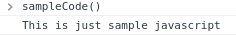

author: YOUR NAME
summary: CODELAB SUMMARY
id: TEMPLATE-CODELAB-ID
categories: blockly,codelab,MORE CATEGORIES
status: Draft
Feedback Link: https://github.com/google/blockly-samples/issues/new

# CODELAB TITLE

## Codelab overview

### What you'll learn
List the skills or tools the developers will learn by the end of this codelab.

### What you'll build
Describe what the finished product will look like.  Include screenshots or gifs.

### What you'll need
List any terms, skills, or tools the developer should be familiar with when starting this codelab.

## Setup

In this section, tell the developer how to get set up to write and run their code.

## Step One Title
Start by explaining the goal of each step.

### Use subheadings to organize your codelab

Start each section by explaining what the next chunk of code will do. Follow it with your code.

Use triple backticks to start and end a fenced code block. Use `js` to set the language for syntax highlighting.

```js
function sampleCode() {
  console.log('This is just sample javascript');
}
```

### Show expected results

Show the developer the expected result of running their code.  You can point to images in the `assets` directory, as in the example below.



Put your assets in a subfolder with your codelab's ID as the folder name.

## Step Two

If you're tackling a complicated topic, you can divide your codelab into multiple steps.

## Summary
In this section, recap the work the developer has done and suggest ways to use it.

### Resources
List any additional resources about this topic that the developer may want to consult.
