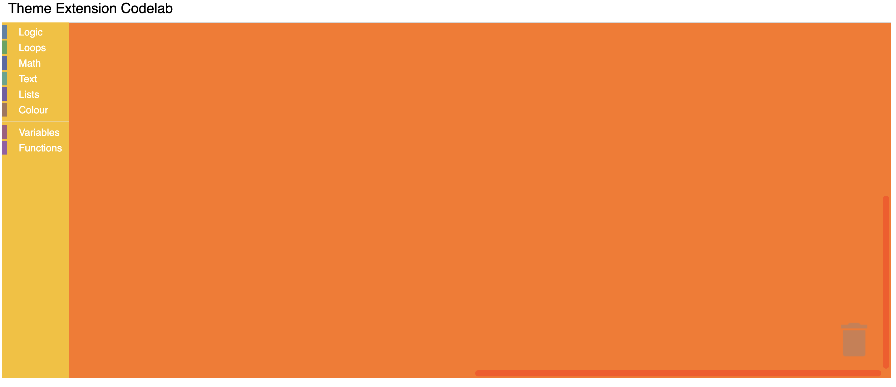
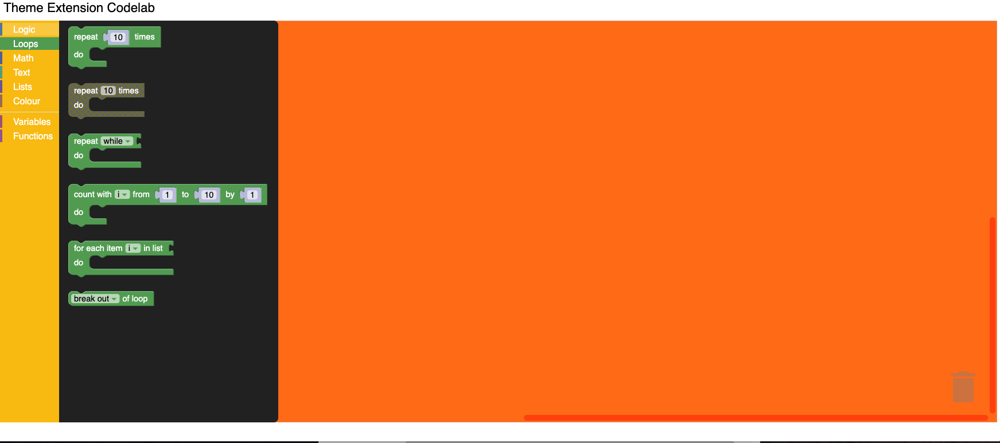

author: Blockly Team
summary: How to extend a theme in Blockly.
id: theme-extension-identifier
categories: blockly,codelab,theme
status: Draft
feedback link: https://github.com/google/blockly-samples/issues/new
 
# Customizing your themes

## Codelab overview
 
### What you'll learn
 
In this codelab you will learn how to:
- Add component styles.
- Add a category style.
- Add a block style.
 

### What you'll build
A very simple Blockly workspace with customized themes.
 
### What you'll need
- A browser
- Basic knowledge of HTML, CSS, and JavaScript.
 
This codelab is focused on Blockly's theme extension. Non-relevant concepts
are glossed over and provided for you to simple copy and paste.

## Setup

### Download the sample code

You can get the sample code for this code by either downloading the zip here:

[Download zip](https://github.com/google/blockly-samples/archive/master.zip)

or by cloning this git repo:

```bash
git clone https://github.com/google/blockly-samples.git
```

If you downloaded the source as a zip, unpacking it should give you a root folder named `blockly-samples-master`.

The relevant files are in `examples/theme-extension-codelab`. There are two versions of the app:
- `starter-code/`: The starter code that you'll build upon in this codelab.
- `complete-code/`: The code after completing the codelab, in case you get lost or want to compare to your version.

Each folder contains:
- `index.js` - The codelab's logic. To start, it just injects a simple workspace.
- `index.html` - A web page containing a simple blockly workspace.

To run the code, simple open `starter-code/index.html` in a browser. You should see a Blockly workspace with a flyout.


## Workspace Theme

In this section you will create a very basic halloween theme, then inject it to display in the workspace.

### Themes

Themes are a way to customize the look and feel of Blockly. Currently, we support customizing block colours, category colours and certain components through the Themes class.

A theme can be created using the constructor or by using defineTheme. Using `defineTheme` makes it easy to extend a pre existing theme and set all values with a single object.

Add the below code in `index.js` right before function start()
```js
Blockly.Themes.Halloween = Blockly.Theme.defineTheme('halloween', {
  'base': Blockly.Themes.Classic,
});
```

And then add a line to inject this theme in function start() in `index.js`
```js
function start() {
    // Create main workspace.
    workspace = Blockly.inject('blocklyDiv',
      {
        toolbox: toolboxCategories,
        theme: Blockly.Themes.Halloween,
      });
 } 
```

Note: At this point, we have just created a new theme. But it does not have any customizations. We will do that next.

## Customize Components 

Within the Halloween theme definition, you can customize the colours of multiple components:

```js
Blockly.Themes.Halloween = Blockly.Theme.defineTheme('halloween', {
  'base': Blockly.Themes.Classic,
  'componentStyles': {
    'workspaceBackgroundColour': '#ff7518',
    'toolboxBackgroundColour': '#F9C10E',
    'toolboxForegroundColour': '#fff',
    'flyoutBackgroundColour': '#252526',
    'flyoutForegroundColour': '#ccc',
    'flyoutOpacity': 1,
    'scrollbarColour': '#ff0000',
    'insertionMarkerColour': '#fff',
    'insertionMarkerOpacity': 0.3,
    'scrollbarOpacity': 0.4,
    'cursorColour': '#d0d0d0',
    'blackBackground': '#333'
  }
});
```

### Test it

Reload your web page. You should see a themed workspace!




## Customize Category Styles 
A category style currently only holds a colour property. It is the colour of the category on the toolbox.
This value can either be defined as a hex value or as a hue. Usually these colours should be the same as 
the colourPrimary on the majority of blocks in the category making it easy for users to tell what blocks 
belong in what category.

Update the Theme definition to have the category styles as below.

```js
Blockly.Themes.Halloween = Blockly.Theme.defineTheme('halloween', {
  'base': Blockly.Themes.Classic,
  'categoryStyles': {
    'list_category': {
      'colour': "#4a148c"
    },
    'logic_category': {
      'colour': "#8b4513",
    },
    'loop_category': {
      'colour': "#85E21F",
    },
    'text_category': {
      'colour': "#FE9B13",
    }
  },
  'componentStyles': {
    'workspaceBackgroundColour': '#ff7518',
    'toolboxBackgroundColour': '#F9C10E',
    'toolboxForegroundColour': '#fff',
    'flyoutBackgroundColour': '#252526',
    'flyoutForegroundColour': '#ccc',
    'flyoutOpacity': 1,
    'scrollbarColour': '#ff0000',
    'insertionMarkerColour': '#fff',
    'insertionMarkerOpacity': 0.3,
    'scrollbarOpacity': 0.4,
    'cursorColour': '#d0d0d0',
    'blackBackground': '#333'
  }
});

```

### Test it

The colour displayed next to the toolbox category should display your new colours.
Clicking on a category will highlight the row with your new colour.




## Customize Block Styles 
A block style currently only holds three different colour properties. They are 'colourPrimary', 
'colourSecondary' and 'colourTertiary'. This value can either be defined as a hex value or as a hue.
For more information on block styles visit our themes [documentation](https://developers.google.com/blockly/guides/configure/web/themes#block_style)

Update the Theme definition to have the block styles as below.


```js
Blockly.Themes.Halloween = Blockly.Theme.defineTheme('halloween', {
  'base': Blockly.Themes.Classic,
  'categoryStyles': {
    'list_category': {
      'colour': "#4a148c"
    },
    'logic_category': {
      'colour': "#8b4513",
    },
    'loop_category': {
      'colour': "#85E21F",
    },
    'text_category': {
      'colour': "#FE9B13",
    },
  },
  'blockStyles': {
    'list_blocks': {
      'colourPrimary': "#4a148c",
      'colourSecondary':"#AD7BE9",
      'colourTertiary':"#CDB6E9",
    },
    'logic_blocks': {
      'colourPrimary': "#8b4513",
      'colourSecondary':"#ff0000",
      'colourTertiary':"#C5EAFF"
    },
    'loop_blocks': {
      'colourPrimary': "#85E21F",
      'colourSecondary':"#ff0000",
      'colourTertiary':"#C5EAFF"
    },
    'text_blocks': {
      'colourPrimary': "#FE9B13",
      'colourSecondary':"#ff0000",
      'colourTertiary':"#C5EAFF"
    },
  },
  'componentStyles': {
    'workspaceBackgroundColour': '#ff7518',
    'toolboxBackgroundColour': '#F9C10E',
    'toolboxForegroundColour': '#fff',
    'flyoutBackgroundColour': '#252526',
    'flyoutForegroundColour': '#ccc',
    'flyoutOpacity': 1,
    'scrollbarColour': '#ff0000',
    'insertionMarkerColour': '#fff',
    'insertionMarkerOpacity': 0.3,
    'scrollbarOpacity': 0.4,
    'cursorColour': '#d0d0d0',
    'blackBackground': '#333'
  }
});
```

### Test it

Click on different blocks in the component and you should see the colours that you applied show up.


## Summary

In this codelab you have learned how to extend and customize themes for the blocks component. 

### Additional information

- [Themes documentation](https://developers.google.com/blockly/guides/configure/web/themes)

- You can also customize the font styles. Details are available in the [documentation](https://developers.google.com/blockly/guides/configure/web/themes#font_styles).
