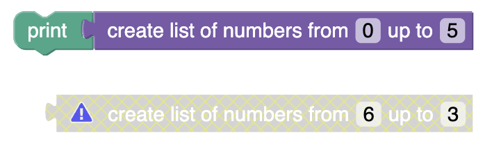
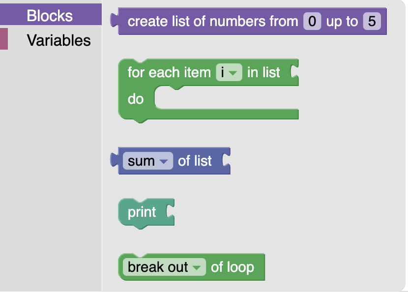
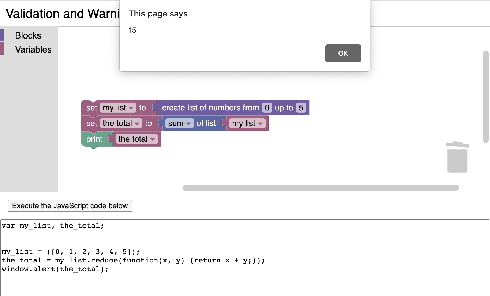
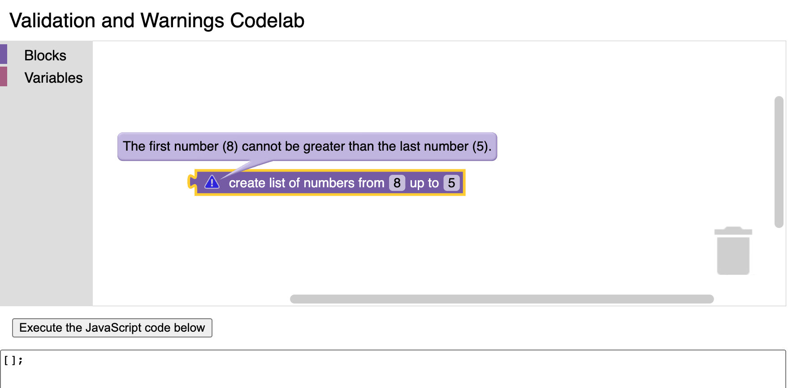
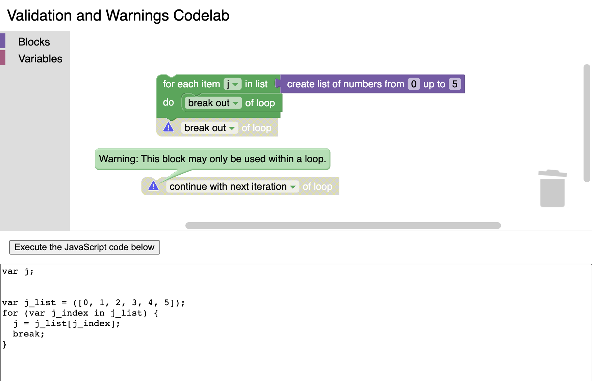

author: Blockly Team
summary: How to validate blocks and display a warning indicator for invalid blocks.
id: validation-and-warnings
categories: blockly,codelab,validation,warning
status: Published
Feedback Link: https://github.com/google/blockly-samples/issues/new

# Validating Blocks and Displaying a Warning Indicator

## Codelab overview

### What you'll learn
This codelab will show you how to ensure that custom blocks either:
1. have everything they need to be able to generate valid code, or
1. display a visual warning to the user that the block is currently invalid.

### What you'll build
In this codelab, you'll create a new custom block type that generates a list of numbers counting up within a given range. The block will validate itself and display a warning if the first number in the range is greater than the last number:



You can find the code for the [completed custom block](https://github.com/google/blockly-samples/tree/master/examples/validation-and-warnings-codelab/complete-code/index.js) on GitHub.

### What you'll need
- A browser.
- A text editor.
- Basic knowledge of JavaScript.
- Basic understanding of the [Blockly toolbox](https://developers.google.com/blockly/guides/configure/web/toolbox).
- Basic understanding of [using JSON to define custom blocks](https://developers.google.com/blockly/guides/create-custom-blocks/define-blocks).

## Setup

### Download the sample code
You can get the sample code for this codelab by either downloading the zip here:

[Download zip](https://github.com/google/blockly-samples/archive/master.zip)

or by cloning this git repo:

```bash
git clone https://github.com/google/blockly-samples.git
```

If you downloaded the source as a zip, unpacking it should give you a root folder named `blockly-samples-master`.

The relevant files are in `examples/validation-and-warnings-codelab`. There are two versions of the app:
- `starter-code/`: The starter code that you'll build upon in this codelab.
- `complete-code/`: The code after completing the codelab, in case you get lost or want to compare to your version.

Each folder contains:
- `index.js` - The codelab's logic. To start, it just injects a simple workspace.
- `index.html` - A web page containing a simple blockly workspace, an empty space where generated code will be displayed, and a button to execute the generated code.

Open the file `starter-code/index.html` in a browser to see what it looks like. You should see a Blockly workspace with a toolbox, and space below it for generated code.


Next, open the file `starter-code/index.js` in a text editor. You will be making changes to this file, but first let's take a look at the contents. The code in this file already does a few things:
1. It uses Blockly's toolbox JSON API to define a toolbox containing a few built-in blocks that will be useful for testing our custom block.
1. In a function called `start()`, it initializes a Blockly workspace with the above toolbox, and adds a change event listener that displays the generated JavaScript code whenever a block is moved or updated in the workspace.
1. In a function called `executeCode()`, it executes the generated JavaScript code.

### Define a custom block type
To prepare for adding validation, let's define a new custom block type named `list_range` with two number fields called `FIRST` and `LAST`. Copy the following code to the beginning of `index.js`:

```js
// Use Blockly's custom block JSON API to define a new block type.
Blockly.common.defineBlocksWithJsonArray([
  {
    'type': 'list_range',
    'message0': 'create list of numbers from %1 up to %2',
    'args0': [
      {
        'type': 'field_number',
        'name': 'FIRST',
        'value': 0,
      },
      {
        'type': 'field_number',
        'name': 'LAST',
        'value': 5,
      },
    ],
    'output': 'Array',
    'style': 'list_blocks',
  },
]);
```

Then, to make this block available from the toolbox, find the toolbox definition in `index.js` and insert this code at the beginning of the list of available blocks, right before the one named `controls_forEach`:

```js
        {
          'kind': 'block',
          'type': 'list_range',
        },
```

Now, if you reload `index.html` and open the toolbox, you should see the new block at the top:



### Generating JavaScript code for the custom block
You can drag this block out from the toolbox into the workspace, but if you try to use it, you'll find that Blockly doesn't know how to generate JavaScript code from this block yet and error messages will appear in the browser console when it tries to update the display of the generated code. To fix this, add the following code below the custom block definition:

```js
// Define how to generate JavaScript from the custom block.
Blockly.JavaScript['list_range'] = function(block) {
  const first = this.getFieldValue('FIRST');
  const last = this.getFieldValue('LAST');
  const numbers = [];
  for (let i = first; i <= last; i++) {
    numbers.push(i);
  }
  const code = '[' + numbers.join(', ') + ']';
  return [code, Blockly.JavaScript.ORDER_NONE];
};
```

Reload `index.html` once again and try adding the new block to the workspace. You should be able to see it successfully generate JavaScript code this time. Try combining it with other blocks to see what the code might look like, and click the button labeled "Execute the JavaScript code below" to see what happens when you run it:



Now we are ready to start adding validation!

## Validating blocks
When you're designing custom blocks, you may find that it doesn't make sense to use the block in certain ways. Depending on the intended purpose of your block, you may want to add constraints on the possible values that can be assigned to its fields, or on where it is used. 

### Basic field constraints
Blockly generally allows users to enter negative values and decimal values for number fields, but for this custom block, let's make sure that only positive whole numbers are allowed. Add `'min': 0` and `'precision': 1` to the fields in the custom block definition so that they look like this:

```js
    'args0': [
      {
        'type': 'field_number',
        'name': 'FIRST',
        'value': 0,
        'min': 0,
        'precision': 1,
      },
      {
        'type': 'field_number',
        'name': 'LAST',
        'value': 5,
        'min': 0,
        'precision': 1,
      },
    ],
```

Then reload `index.html`, drag the custom block to your workspace, and try entering various values such as negative numbers or decimals. Notice how invalid values are immediately converted to the nearest valid value!

If you want, you can also add a `'max'` constraint to a number field.  

### Adding custom validation to a field
The built-in constraints are very convenient, but sometimes you might need to add custom constraints. For example, let's say that our custom block needs the first number of the range to be even, and the last number to be odd. We can easily implement the even constraint by setting the `'precision'` constraint of the `FIRST` field to `2`, but the odd constraint requires a custom validator. 

So far, we've been using Blockly's JSON API for defining custom blocks, but Blockly also has a JavaScript API with more advanced features, and one of those features is defining custom validators. Fortunately, we don't have to convert our entire custom block definition to the JavaScript API in order to take advantage of these advanced features, because Blockly has a system for adding JavaScript extensions to blocks that were defined with the JSON API. 

Let's give our custom block a new extension called `list_range_validation`. Add `'extensions': ['list_range_validation']` to the end of the custom block definition in `index.js` like so:

```js
Blockly.common.defineBlocksWithJsonArray([
  {
    'type': 'list_range',
    ...
    'style': 'list_blocks',
    'extensions': [
      'list_range_validation',
    ],
  },
]);
```

Then copy the following code to `index.js` underneath the custom block definition to register an implementation of that extension:

```js
Blockly.Extensions.register('list_range_validation', function() {
  // Validation code to be added here...
});
```

The extension's function will be executed every time the custom block is instantiated, and the block instance itself will be implicitly available inside the function using JavaScript's `this` keyword. We can use it to access Blockly's JavaScript API for blocks, including validators. To add a validator on the `LAST` field, put the following code inside the extension function:

```js
  this.getField('LAST').setValidator(function(newValue) {
    // Validation of newValue for LAST field to be added here...
  });
```

Blockly validator functions are called whenever the user enters a new value for that field, and the new value is passed to the function as a parameter. The parameter might be an invalid value, but validator function can return a valid value to override the user input. To force the `LAST` field to be an odd number, put the following code inside the validator function:

```js
    return Math.round((newValue - 1) / 2) * 2 + 1;
```

Afterwards, your extension code should look something like this:

```js
Blockly.Extensions.register('list_range_validation', function() {
  // Add custom validation.
  this.getField('LAST').setValidator(function(newValue) {
    // Force an odd number.
    return Math.round((newValue - 1) / 2) * 2 + 1;
  });
});
```

Reload `index.html` now, then drag the custom block to your workspace and try setting the `LAST` field to various values. Notice how it always turns into an odd number!

## Displaying warnings

Both Blockly's built-in validators and custom validators are nice because they immediately correct any errors so that there should never be any interruption in the validity of the blocks in the workspace or in the validity of the code that it generates. This results in a smooth, pleasant experience for the user, and you should take advantage of these validators whenever possible. 

However, there may be invalid conditions that can't be corrected automatically because it's ambiguous what the desired result is. For example, it doesn't make much sense for our custom block to have a `FIRST` field with a greater value than the `LAST` field, but it's not obvious which of the two fields is "wrong." The best we can do is warn the user about the problem, and let them decide how to fix it. 

In the case of our custom block, we want our extension to be notified whenever either field is updated, so that it can check both of the fields to determine whether the block is currently valid. We can set that up with a general change listener by adding this code inside the extension function after the custom validator:

```js
  // Validate the entire block whenever any part of it changes,
  // and display a warning if the block cannot be made valid.
  this.setOnChange(function(event) {
    const first = this.getFieldValue('FIRST');
    const last = this.getFieldValue('LAST');
    const valid = (first < last);
    this.setWarningText(valid
      ? null
      : `The first number (${first}) must be smaller than the last number (${last}).`);
  });
```

This change listener function will get called whenever any part of the block is updated. It has access to all of the block's current field values, as well as the block's parents and children, if any. In this case, it reads both field values and compares them to determine whether the block is valid. Then it calls `this.setWarningText(...)`, which can accept either `null` indicating that there is nothing wrong or a string describing the problem.

Reload `index.html`, drag the custom block into the workspace, then edit the fields to make the `FIRST` field greater than the `LAST` field. You should see a warning indicator, and you can click on it to see the warning message:



Depending on the severity of the issue, this might be sufficient for your custom block's needs. However, if the validity issue is severe enough that it wouldn't make sense to even try to generate code from the block, you should disable the block in addition to displaying a warning, because disabling a block makes code generators pretend the block doesn't exist. For example, most languages only allow `break` or `continue` statements inside of loops, so Blockly's corresponding built-in blocks are automatically disabled when used outside of loops:



You can disable a block using `this.setEnabled(false)`, although there are some caveats: disabled blocks can't be dragged out of the toolbox flyout, and the act of disabling a block usually adds an event to Blockly's undo history. That's probably not the behavior you want when validating a block, so you can avoid both of these effects with the following code, which you should put inside the change listener function after setting the warning text:

```js
    // Disable invalid blocks (unless it's in a toolbox flyout,
    // since you can't drag disabled blocks to your workspace).
    if (!this.isInFlyout) {
      const initialGroup = Blockly.Events.getGroup();
      // Make it so the move and the disable event get undone together.
      Blockly.Events.setGroup(event.group);
      this.setEnabled(valid);
      Blockly.Events.setGroup(initialGroup);
    }
```

Reload `index.html` one last time, drag out the custom block, and edit the fields to make the `FIRST` field greater than the `LAST` field again. This time, the block should be disabled, and it won't generate code even if it is combined with other blocks:


## Summary
In this codelab, you learned:
* How to use the field validators in Blockly's JSON API.
* How to create an extension that adds functionality to a block.
* How to create custom field validators.
* How to validate the entire block when any part of it changes.
* How to display a warning message on the block.
* How to disable a block (without adding an event to the undo history).

You can find the code for the [completed custom block](https://github.com/google/blockly-samples/tree/master/examples/validation-and-warnings-codelab/complete-code/index.js) on GitHub.

### Resources
For more information related topics, check out the documentation:
* [Defining the toolbox](https://developers.google.com/blockly/guides/configure/web/toolbox)
* [Defining custom blocks](https://developers.google.com/blockly/guides/create-custom-blocks/define-blocks)
* [Generating code from blocks](https://developers.google.com/blockly/guides/create-custom-blocks/generating-code)
* [Creating extensions](https://developers.google.com/blockly/guides/create-custom-blocks/extensions)
* [Listening for change events](https://developers.google.com/blockly/guides/configure/web/events)
* [Custom validators](https://developers.google.com/blockly/guides/create-custom-blocks/fields/validators)
* [Custom block style guide](https://developers.google.com/blockly/guides/create-custom-blocks/style-guide)
