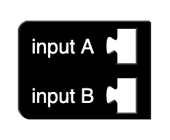
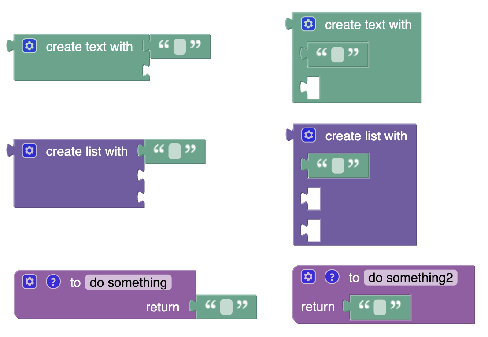

# @blockly/input-row-separators [](https://github.com/google/blockly)

A [Blockly](https://www.npmjs.com/package/blockly) plugin providing a renderer that treats dummy inputs like row separators, allowing block designers to arrange multiple inline value input connectors on separate rows by inserting dummy inputs between them. Example blocks are provided.

## Installation

### Yarn
```
yarn add @blockly/inline-row-separators
```

### npm
```
npm install @blockly/inline-row-separators --save
```

## Usage
This plugin registers a renderer called `"inline-row-separators"`. To use it, install the plugin, import it (with side effects), then refer to the new renderer in your workspace options:

```js
import * as Blockly from 'blockly';
import '@blockly/inline-row-separators'; // import with side effects.

function start() {
  const workspace = Blockly.inject('blocklyDiv', {
    toolbox: toolbox,
    renderer: 'inline-row-separators',
  });
}
```

Initially, not much will be different. However, if you define any block types that insert a dummy input between two inline value inputs, the inline value input connectors will now be rendered on separate lines:

```js
Blockly.common.defineBlocksWithJsonArray([
  {
    'type': 'inline_test',
    'message0': 'input A %1 %2 input B %3',
    'args0': [
      {'type': 'input_value', 'name': 'A'},
      {'type': 'input_dummy'},
      {'type': 'input_value', 'name': 'B'},
    ],
    'inputsInline': true,
  },
]);
```



This plugin also defines some alternative versions of built-in Blockly blocks that demonstrate the feature: `"inline_text_join"`, `"inline_lists_create_with"`, and `"inline_procedures_defreturn"`. You can replace the built-in blocks `"text_join"`, `"lists_create_with"`, and `"procedures_defreturn"` with these alternatives (which allows you to use Blockly's built-in code generators with these new block types) by importing and calling `overrideOldBlockDefinitions()`:

```js
import * as Blockly from 'blockly';
import {overrideOldBlockDefinitions} from '@blockly/inline-row-separators';

overrideOldBlockDefinitions();
```



The new renderer is based on Blockly's default `"geras"` renderer, but could easily be adapted to other renderers.

## License

Apache 2.0
