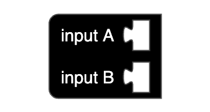
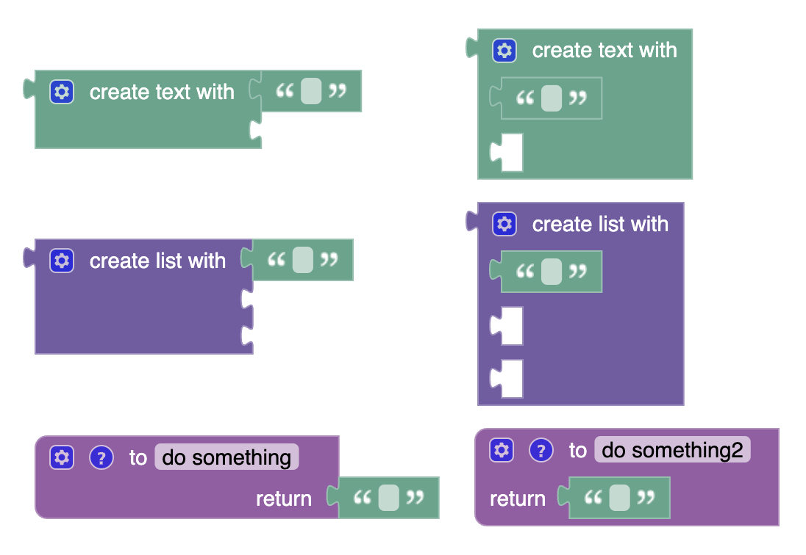

# @blockly/renderer-inline-row-separators [](https://github.com/google/blockly)

A [Blockly](https://www.npmjs.com/package/blockly) plugin to create a renderer that treats dummy inputs like row separators, allowing block designers to arrange multiple inline value input connectors on separate rows by inserting dummy inputs between them. Example blocks demonstrating the feature are provided, as well as a function to add the feature to your own renderer.

## When to use

### For Blockly versions >= v10.2.0

This plugin is deprecated because its functionality will be made obsolete by a new feature being introduced in [Blockly v10.2.0](https://github.com/google/blockly/releases/tag/blockly-v10.2.0): row separators can now be easily added either by adding newline characters ("\n") in the message field of JSON block definitions, or by adding EndRowInputs to blocks via the JavaScript API. For more information, see the [Block Inputs documentation](https://developers.google.com/blockly/guides/create-custom-blocks/define-blocks#block_inputs).

### For Blockly versions < v10.2.0

It is strongly recommended that instead of using this plugin, you upgrade to a version of Blockly >= v10.2.0. However if that is not possible, you can use the current version of this plugin. Note that this plugin will be removed in the future, so by newly installing it now, you will be introducing a dependency you will be forced to remove in the future if you want to remain up-to-date with core Blockly.

## Installation

### Yarn
```
yarn add @blockly/renderer-inline-row-separators
```

### npm
```
npm install @blockly/renderer-inline-row-separators --save
```

## Usage

### Using the modified thrasos renderer

This plugin registers a renderer called `"thrasos-inline-row-separators"` based on Blockly's built-in `"thrasos"` renderer. To use it, install the plugin, import it (with side effects), then refer to the new renderer in your workspace options:

```js
import * as Blockly from 'blockly';
import '@blockly/renderer-inline-row-separators'; // import with side effects.

function start() {
  const workspace = Blockly.inject('blocklyDiv', {
    toolbox: toolbox,
    renderer: 'thrasos-inline-row-separators',
  });
}
```

Initially, not much will be different. However, if you define any block types that insert a dummy input between two inline value inputs, the inline value input connectors will be rendered on separate lines:

```js
Blockly.common.defineBlocksWithJsonArray([
  {
    'type': 'inline_test',
    'message0': 'input A %1 %2 input B %3',
    'args0': [
      {'type': 'input_value', 'name': 'A'},
      {'type': 'input_dummy'},
      {'type': 'input_value', 'name': 'B'},
    ],
    'inputsInline': true,
  },
]);
```



### Using inline versions of built-in blocks

This plugin also defines some alternative versions of built-in Blockly blocks that demonstrate the feature: `"inline_text_join"`, `"inline_lists_create_with"`, and `"inline_procedures_defreturn"`. You can replace the built-in blocks `"text_join"`, `"lists_create_with"`, and `"procedures_defreturn"` with these alternatives (which allows you to use Blockly's built-in code generators with the inline version of these blocks) by importing and calling `overrideOldBlockDefinitions()`:

```js
import {overrideOldBlockDefinitions} from '@blockly/renderer-inline-row-separators';

overrideOldBlockDefinitions();
```



### Adding the row separator feature to other renderers

This plugin also exports a function called `addInlineRowSeparators` that you can use to add the same inline row separator feature to any class extending Blockly's Renderer, including your own.

```js
import * as Blockly from 'blockly';
import {addInlineRowSeparators} from '@blockly/renderer-inline-row-separators';

const NewRenderer = addInlineRowSeparators(YourRenderer, YourRenderInfo);
Blockly.blockRendering.register('new-renderer', NewRenderer);
```

## License

Apache 2.0
